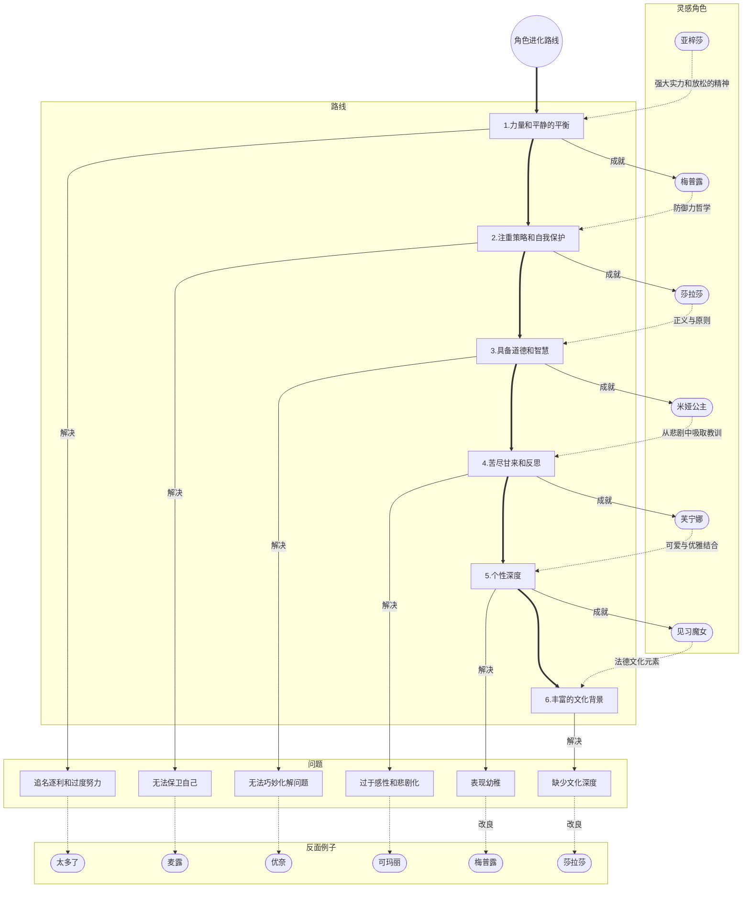

# 休闲番剧角色进化路线

*Maple-Kaede* *2024-11-05*

如果说热血番剧是带你飞驰过山车，那么休闲番剧就是让你舒舒服服躺在沙发上，沏上一杯热茶，看主角们悠然地享受生活。而就在这样的节奏中，角色的个性和成长显得尤为重要——毕竟，慢节奏的故事更考验角色是否有足够的吸引力，让人想继续看下去。

随着追番之路越走越远，我也不知不觉摸索出一套“休闲番剧角色进化路线”。从喜欢上“强大但佛系”的主角，到渐渐重视角色的韧性、自我保护，乃至他们的文化背景和生活哲学，我的角色审美标准就这样一路“进化”，逐渐形成了一种充满趣味的“角色塑造清单”。每一次新的发现，都让我对角色的理解更进一步。

这篇文章会带你一起回顾这些“进化节点”——那些让我眼前一亮的角色究竟是如何丰富我的角色审美的。从实力与平静并存的小能手，到优雅可爱的文化达人，这些角色为休闲番剧注入了温暖而又独特的魅力。希望你能和我一起享受这场关于角色魅力的慢生活之旅，发现其中的乐趣与深度。

## 第一层境界：力量与平静的平衡

还记得我在《放松与成长》里说过的话吗？我之所以爱上休闲番剧，是为了逃避那些动辄刀光剑影、斗智斗勇的剧情。于是，当我偶然遇上《打了300年史莱姆》时，简直一见钟情。这部番剧不仅开启了我的“休闲番剧大门”，更奠定了我对角色评价的初步标准：**力量与平静的平衡**。

故事中的主角亚梓莎，可谓是“过劳一族”的典型。因为在现代社会累死在工作岗位上，她意外穿越到异世界，这次发誓不再继续过劳生活了。重获新生的她拥有了世界第一的实力，但她偏偏不爱冒险、不去挑战更强的对手。相反，她选择呆在高原之家，过上了悠然自得的田园生活。什么拯救世界、什么冒险的激情？亚梓莎统统不在乎！她觉得休息和享受生活才是真正的正事，甚至会劝身边的人别瞎折腾，要学会放松，健康第一。她的生活哲学是，实力再强，也要学会享受每一天。

这个“力量与平静”的标准，打破了传统番剧里那些“主角必须上天入地、追名逐利”的老套套路。要知道，传统番剧里的角色往往拼命奋斗，一心向上，而亚梓莎却告诉我们：“拥有强大实力并不等于要无休止地折腾自己。”这在无形中为角色带来了另一种魅力：既有实力，但也会选择优雅地停下脚步，享受一份来之不易的平静生活。

## 第二层境界：注重策略与自我保护

《打了300年史莱姆》为我开启了休闲番剧的奇妙大门，我欣喜若狂，迫不及待地去找了更多类似的轻松题材。然而，看得多了，我也逐渐发现了一些陷阱。比如在《我不是说了能力要平均吗》中，主角麦露虽然实力强大，心态也相当佛系，可关键时刻她经常不太愿意出手，而且在战斗中的防御力明显偏低。这让我不禁感叹道，一味放松虽好，但必要时保护自己和队友的能力却不能忽视。

于是我把目光转向了两部以游戏为背景的番剧：《无限系统树》和《全点防御力》。吸取了“能力平均”的教训后，我这次对自己说：要找一个不止会“享受生活”，更会“保护自己”的角色。于是，我选择了专注防御的《全点防御力》，并且事实证明这是个相当明智的决定：我被其中的梅普露深深吸引，她那专注于防御的独特游戏风格让我觉得“是的，这就是我追求的第二层标准！”她的策略不仅有效地保护了自己，还为队友提供了稳固的屏障，让大家在战斗中有了安全感。可以说，梅普露带来的不仅是无敌的防御值，还是一种全新的**策略与自我保护**的理念。

梅普露的玩法有趣又聪明，她从一开始就专注防御技能，几乎每次战斗都能自如地面对强敌。她的技能不仅可以保护自己，还能给队友提供全方位的防护，让团队在遇到挑战时能“毫发无损”地从容应对。更妙的是，她的策略出奇制胜，总能发现其他玩家忽略的操作空间。通过这种“防御为主”的玩法，她不仅能悠闲享受游戏，还带动了一种不以伤害为唯一目标的休闲策略。

这个标准补足了休闲番中“缺少保护意识”的问题，让角色在享受轻松生活的同时，仍能在关键时刻凭借策略保护自己和他人。这不仅增强了角色的韧性，也为他们营造了一个更安全、更持久的成长空间。有趣的是，我现在的网络用户名也正是因为她——她带给我的影响，不止是番剧中的那份从容和智慧。

## 第三层境界：具备道德与智慧

在梅普露的“防御力哲学”加持下，我探索了不少遵循前两层标准的角色。表面上，他们悠闲自在，身怀力量，还知道适时保护自己，简直完美！可没过多久，我就发现了一个新问题：光有实力和防御还不够，如果角色缺乏约束自己的智慧和道德感，他们随时可能从“强力主角”滑向“麻烦制造机”。

想想《熊熊勇闯异世界》的优奈，她完全契合力量与保护的标准，却不太擅长考虑周围人的感受，随性得有点让人捉急。她常常要别人跟着她的步调调整，这样的主角，在温馨场景中倒是挺萌，但放在严肃情节里就未免有些不靠谱。更典型的是《里亚德录大地》里的葵娜，作为世界最强战士，她的破坏力令人咂舌，但往往用得有点太过头，经常误伤无辜的人。

就在我为这个问题发愁时，《新人炼金术师的店铺经营》带来了曙光。在2022年秋季的这部番剧中，主角莎拉莎的出现真是恰到好处！她虽然是炼金学院的优秀毕业生，却选择在偏远的小村庄里开了一家小店，过着悠然自得的生活。这个选择真是太棒了，完全符合我对休闲的追求。而莎拉莎不仅在保护自己和他人方面表现出色，更在关键时刻展示了她的**智慧和道德**准则。无论是遭遇黑心商人坑害，还是被土匪袭击，她都能用“组合拳”解决：该用智慧时毫不含糊，该动真格时也不手软。不得不说，这一点比起许多一言不合就“放大招”的角色可爱多了！

然而，莎拉莎真正让我佩服的，是她经营小店的方式——诚信与责任心。她坚决坚持合理定价，保证产品质量和效果，这让她在村庄内建立了良好的信誉，获得了稳定的客户群体。与此同时，她并不把“善行”变成“施舍”，她明白适度回报的重要性，这样才让帮助别人成为了可持续的行为，兼具善意和理性。用莎拉莎的逻辑来说，帮助他人不是牺牲自己，而是互相成就，最终大家都能越过越好。

这一标准弥补了那些主角“滥用武力”和“随心所欲”带来的缺憾。莎拉莎的智慧和道德，让我们看到了一种更成熟的强大：她在面对挑战时不是一味蛮干，而是思考如何真正解决问题；她的每个决策也不只是为了自己，而是考虑到周围人，让她的力量在合理使用中更具温度和影响力。既具备强者的力量，也承担起身为强者的义务，莎拉莎就是“休闲”角色的标杆，她展现的是一种智慧、稳重的强大魅力，正是这种角色，才真正诠释了休闲番剧中“休闲”二字的深意！

## 第四层境界：苦尽甘来和反思

故事进行到这里，休闲番剧的角色标准已经基本成型了。其实我也挺满意，觉得标准已经足够完善了，而这一套标准也稳定地执行了整整一年。然而，角色塑造之路从不乏惊喜——2023年秋季番的一位角色闪亮登场，把我的观念彻底颠覆。

这部番剧就是《堤亚穆帝国物语》。故事的主角米娅，是个“高贵冷艳”的帝国公主。可惜的是，她的政治觉悟堪称负数，最终被推上断头台，体验了“贵族落难”的悲惨结局。但就在命运即将敲响最后一声钟响时，时光倒流，米娅重回童年，还意外得到了一个会预告未来的“命运日记”。于是乎，米娅开始了她的“改命”大冒险，试图一边愉快地享受人生，一边避免“上断头台”的惨剧再次发生。

尽管这是个充满轻松搞笑氛围的故事，但米娅每一次的决定背后，都带着对过去悲剧的深深反思。每当她遇到挑战，总会不自觉地联想到前一轮人生里的悲惨回忆，然后内心默念：“这一次可不能再栽了！”这种对过去的反思和对未来的努力，让人忍不住为她加油。看着米娅一点点成长，从“落难公主”变成真正具备担当的领导者，这种今昔对比简直感人至深。而且，这种苦尽甘来的情感深度也给了角色的智慧一个合理的来源，不再只是简单的“天降智慧”。

有趣的是，米娅的故事还与另一部同期播出的番剧《家里蹲吸血鬼的苦闷》形成了鲜明的对比。后者的主角玛丽也是个被悲剧压迫的角色，但她每次想起过往的伤痛，选择的不是反思和改变，而是陷入深深的逃避。最终，她一次次地成为敌人的靶子，被各种麻烦缠上身。这两部作品告诉我，悲剧处理得当，可以让角色走向“苦尽甘来”的成长，而如果放任悲剧把角色拖入黑暗，则只会让人感到压抑。

其实，我曾经坚定地认为“休闲番剧”和“悲剧”根本不是一个次元的存在，两者一旦相遇，整个氛围就瞬间崩塌。然而，米娅成功改变了我的偏见！在她的启发下，我不得不承认，这种**苦尽甘来与反思**的标准真的很有必要。休闲番剧中的角色不再只是“经历过悲惨事件”而已，而是能从那些不堪的过往中反思成长，化解痛苦，将其转化为一种带有智慧的“苦尽甘来”。这种对悲剧的克制处理，使得原本“无风无浪”的番剧，突然多了几分让人会心一笑的韵味，更加彰显出它的独特魅力。

## 第五层境界：可爱与优雅的结合

走到第四层“苦尽甘来与反思”的时候，我已经觉得自己的休闲番剧观影之路够丰富了。每次看到角色们的内心成长和对悲剧的超越，心里总有种满满的成就感。这段时间里，我复习了很多曾经看过的角色，比如《转生王女与天才千金的魔法革命》中的艾妮丝，她因为无法使用魔法而决定创造属于自己的魔法，这种“自我革新”的悲剧属性让我十分动容。与此同时，我也从未停下探索的脚步——很快，我就被一股全新的审美力量彻底吸引了。

故事要从《原神》的更新说起。当时，一个以法国元素为主题的国家登场，同时带来了一位新角色：芙宁娜。她具备“悲剧属性”，但更引人注目的是她身上的“法式优雅”。芙宁娜不仅展示出法国宫廷的尊贵优雅，还带着一种无法忽视的可爱魅力。这种**可爱与优雅的结合**令我为之动容，并由此奠定了我休闲番剧角色塑造的第五层境界。

芙宁娜的服饰设计令人惊艳：她穿着象征皇家高贵的蓝色西装，配上法国国花鸢尾花的图案装饰，头戴精美的皇冠，身披燕尾服，妥妥地体现了法式宫廷的典雅和奢华。但同时，她又拥有日式角色的可爱特质，比如经典的“大眼睛”，以及温柔的白色短发。这种设计给人一种亲和力，又不失端庄感。仿佛每一帧画面都在告诉我们：可爱不必和优雅对立，反而可以让角色的气质更加立体。

这让我终于明白了心中的那点缺憾！就拿梅普露来说吧，虽然可爱得无可挑剔，但气质上总觉得缺了点什么。啊，现在我终于明白少的是什么了——少的是一种独特的混合气质。单一的可爱设定当然没有问题，可是只要再加入一点优雅气质，角色的层次就会更加丰富，观感也会更加细腻。这一标准的出现，让我意识到，在休闲番剧里，角色完全可以跳出单一的“可爱”框架，让形象更加丰满立体。

自此，角色不再只是可爱或坚强，而是一个多面体，能够引发观众不同的情感共鸣。于是，第5层境界“可爱与优雅结合”正式成型，成为我评判角色新境界的一盏明灯。

## 第六层境界：丰富的文化背景

当我达成了“可爱与优雅结合”的境界后，我的心中突然燃起了一个新目标：让角色不仅有颜值有内涵，还要有浓厚的文化底蕴！当我开始审视各类角色，期待发现一位背景深厚、设计更具层次感的“文化瑰宝”时，2024年的新番剧却在给我泼冷水——粉丝向的番剧充斥着市场，休闲向、注重文化背景的角色根本难觅踪影！

为了追求这个“丰富的文化背景”，我不断挖掘不同资源。轻小说虽然看起来很吸引人，但由于阅读时间较长，我最终没有选择它们。经过一番深思熟虑，我还是没有想出合适的选择。就在我陷入低谷的时候，一次在YouTube上的偶然发现让我眼前一亮——《Paysage de Strahlburg》。光是看这标题就散发出一股浓厚的法国风情！

这是一张音乐专辑，由一位喜欢异世界和幻想题材的音乐制作人创作，他称之为《见习魔女》系列，灵感源自法国阿尔萨斯地区的文化背景，还带着浓浓的哥特与幻想风格。我当时就觉得，哇，这不就是“文化背景的天花板”嘛！于是，第六层境界：**丰富的文化背景**就此诞生。

在这个设定中，见习魔女们的角色设计非常吸引人——她们采用了哥特萝莉风格，既可爱又优雅，还带着幻想的魔女设定。这种多元文化的碰撞让角色更加丰富，还多了几分神秘与奇幻。小镇Strahlburg的名字也带有浓浓的德式韵味，意为“光辉之堡”，充满诗意，同时也让角色的生活背景与文化环境相辅相成。这样的文化设定，不但让角色个性更加鲜明，也让整个故事的气氛多了几分深度和独特感。

回顾我之前的第三层标准，莎拉莎作为一个店铺经营者的道德和智慧的确非常适合休闲番剧的需求，但相比之下她的背景文化还是显得单薄了些。这就是“丰富的文化背景”标准的巧妙之处——拥有扎实文化背景的角色会显得更加立体丰满，充满色彩与层次感。这正是休闲番剧角色进化之路上的高峰——让角色成为文化和个性交织的精彩呈现！

## 结语：休闲番剧角色进化之路的终极愿景

以上这六大境界，就是我心目中休闲番剧角色的“修炼”路线图。从最基础的“力量与平静”平衡，到策略满满的“自我保护”，再到兼具道德与智慧的“三观上线”，然后是“从悲剧中汲取教训”，接着是“优雅与可爱的并存”，最后穿上“多元文化”的华丽披风——每一层都让角色逐步进化，最终成为具备深度和魅力的“鲜活个体”。这样的进化路线，让每个角色不仅仅是个虚构形象，更是带着故事、深度和文化背景的活生生的“人”，为休闲番剧增添了独特的味道。

说到这里，有个小秘密其实早就藏不住了——从第五层标准开始，我就没找到完全符合的新角色了！所以，这套指南更像是我的一个愿景，希望未来能遇见更符合这些标准的角色。而且，这些标准可能还会不断扩展出更高的境界，就像某位YouTuber说的那样：“每当我以为自己抓住了某些东西的本质，总会有新的角色或作品推翻我的认知。”也许在不久的将来，我们还会发现新的、更出色的角色塑造标准。

至于未来这条进化之路会走向哪里？谁知道呢！尽管眼下轻小说的角色标准似乎在走下坡路，但我始终相信，总会有惊喜在路上等着我们。这世界，总在螺旋上升嘛！保持好奇、保持开放，让我们一起期待那些角色的进化吧，说不定他们会比我们想象中更加精彩呢！

## 附录：休闲番剧角色进化路线简图

