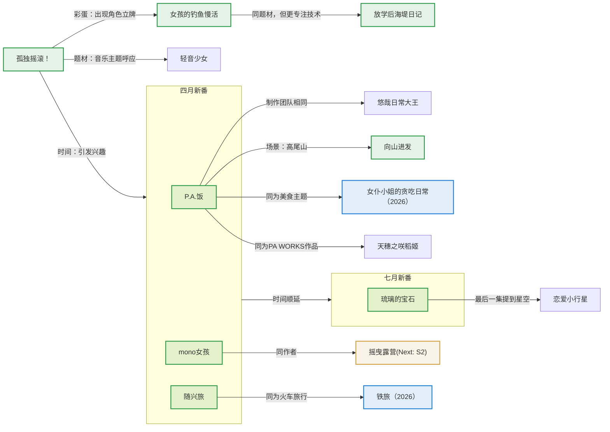

# 山川与人间：2025年休闲番剧年度总结

*2025-12-20*

---

## 1. 引言：为什么是“山川”与“人间

### A. 赴一场山海之约：休闲番剧观看年度总结

时光荏苒，2025年也即将画上句号。

这一年对我来说是特别的一年，无论是在生活节奏，还是在观剧选择上，都有许多新的体会与方向。不同于以往只关注异世界日常，这一年我看了更多题材各异、氛围独特的休闲番剧：有静谧的山路，也有热闹的集市；有远方的旅行，也有归途的停靠。

当我回望这一整年的观剧时光，那些被风吹起的帐篷、被列车掠过的山水、被夕阳染红的小镇街角，全都成了这一年的记忆注脚。于是，我决定把它们整理成一篇新的总结。

就让这篇《山川与人间》作为我与2025年休闲番剧的纪念，也作为我再次出发前的一次温柔回望。

### B. 今年的主题是什么：上山下乡的休闲篇章

2025年的休闲番剧，在我的观影地图上，呈现出一种“上山下乡”的趣味轨迹：有高山的清凉，也有人间的温度；有帐篷与篝火的静谧，也有伙伴之间的笑语与牵挂。

这一年里，我看到了少女们在山路上缓慢前行的脚步，也看到了旅途中结下的友谊与默契；有时候是在远方露营，有时又在归途的火车上体会那份久违的安心。那些山川与人间的片刻交织，让休闲番剧的世界变得更加立体，既有自然的宽阔，也有人心的细腻。

因此，今年的年度总结，我想以“山川与人间”为主线，把这一年里的户外与情感篇章并行展开。既写登山与露营的风景，也写角色之间的情感纽带，让你能在这一篇总结里，感受到休闲番剧中那份既来自自然，又来自心灵的自由与惬意。

---

## 2. 孤独的转机：重新发现“现实系”的可能性

### A. 长久以来的误解：我为何一度回避“现实世界设定”

其实早在 2023 年那篇以“放松与成长”为主题的年度总结中，我就已经明确写下过一个目标：希望未来能更多地去探索非异世界题材的番剧，去接触露营、钓鱼、登山这些更贴近现实生活的内容。那时的我，对这种“现实系日常”的想象是美好的，也是真诚的。

但说来惭愧，这个目标在之后很长一段时间里都停留在纸面上，始终没能真正迈出那一步。

原因并不复杂，而是源自一种根深蒂固的刻板印象。受零几年大量校园番剧的影响，在我的认知里，“现实世界设定”几乎天然等同于“校园设定”。而校园番剧又往往围绕着同学、老师、课堂、食堂这些固定空间反复展开，叙事重心被牢牢限制在封闭的日常循环之中。情节的发展似乎总绕不开既定套路，人物的行动动机也显得局促而保守。

这种印象在某些作品中被不断强化。就拿《某科学的超电磁炮》来说，哪怕故事已经推进到对抗强敌、拯救他人的阶段，角色的行为准则依然被牢牢限制在“校园生活”之内，夜不归宿会被宿管抓，日常秩序始终凌驾于一切冒险之上。更不用说传统的 galgame 式叙事，本质上就是在有限的校园关系网中反复排列组合情感选项。

久而久之，我便下意识地将“现实系番剧”与“发展受限”“缺乏自由”等特征画上了等号。也正因如此，过去几年里，我才会愈发执着于异世界题材。那并不只是对奇幻设定的偏好，更像是一种逃离，逃离我心中那个被校园框架牢牢束缚的“现实世界”。在这样的前提下，我也逐渐形成了一个误判：现实世界的番剧，大概就是无聊的。

### B. 校园被边缘化的一次尝试：舞台还在，但不再重要

真正的转机，出现在今年 4 月 28 日上映的《孤独摇滚》剧场版。

从我正式进入 ACG 世界开始，去电影院观看优秀动画电影几乎已经成了一种固定仪式。这一次本来也只是一次再普通不过的例行观影，并没有抱着“会改变什么”的期待。但在走出影院之后，我却产生了一个强烈的念头：我要把 TV 版补完。

也正是补完 TV 之后，我第一次清晰地意识到，《孤独摇滚》彻底打破了我对“现实系番剧”的既有想象。

它当然是一个以 JK 为主角的故事，但校园在其中几乎只承担了“背景板”的功能。课堂、老师、校内规则的存在感被压缩到极低，低到你不会再被它们牵着注意力走。观众真正被带去的地方，是社恐少女的房间、街头的公园、排练用的地下室、灯光昏暗却真实的 livehouse 舞台。也就是说，角色真正生活与成长的空间，几乎全部发生在校园之外。

这是我第一次看到，现实世界设定可以完全不被学校所束缚。

更重要的是，《孤独摇滚》并没有走向极端：它没有把音乐包装成耀眼的偶像叙事，也没有刻意选择“梦想一定要闪闪发光”的宏大命题。相反，它更像是一部贴近现实的青春小品：几个人凑在一起组乐队，排练、紧张、失误、调整节奏，一切都被毫无隐瞒地呈现出来。舞台上的表演并不完美，但正因如此，才显得格外真实。

与传统偶像音乐番常聚焦于舞台光辉、竞争压力或戏剧性的成长蜕变不同，它与其说是在讲音乐，不如说是在讲“一个社恐如何在尽量低压的环境中，一点点找到自己的位置”。冲突被控制在可承受范围内，关系的建立以温和的方式推进，没有传统音乐番中常见的乐队解散、摔乐器等激烈转折。它让人感到，角色并非被剧情驱策着奔跑，恰恰是在一个足够安全的空间里，从容地走出了自己的步伐。

也正是在这里，我第一次意识到：原来现实系番剧，并不等同于校园框架；番剧世界的自由，也并不一定来自远离现实本身。

### C. 愿你迎来黎明：迈向现实系日常的第一步

如果说《孤独摇滚》让我意识到“并非一定要逃离现实世界”，那么波奇真正留给我的，是另一层更重要的启示：人可以按照自己的节奏成长。

《孤独摇滚》所描绘的，是一个足以接住胆小鬼的温柔世界。波奇在故事中遇到的每一个人，都有意为她让出了一条平坦的小路。没有人催促她必须立刻改变，也没有人用“你这样不行”去否定她的存在。大家只是陪着她，一边等，一边相信她终究会往前走一点点。

我很喜欢这种叙事模式。哪怕今天还是没能好好完成自我介绍，哪怕在舞台上因为紧张而手忙脚乱，哪怕只能躲在纸箱里完成第一次演出，也依然有人在旁边笑着鼓掌，认真地对她说一句：“已经很棒了哦。”

而波奇的成长，也并不是靠某一次爆发式的突破完成的。她从最初连面对观众都不敢，到逐渐站上 livehouse 的舞台；从躲藏、逃避，到在学校文化祭上顺利完成演出，这个过程没有依靠奇迹，没有突然开挂，只有一次次小得几乎不起眼的前进。正是这种“慢慢来”的积累，让她最终能够站在更大的舞台上，继续演奏下去。

这种成长方式，对我来说是一次极其重要的提醒。现实世界里，我们太习惯被要求“快一点”“成熟一点”“马上适应”，却很少有人告诉我们：迟疑、迷茫、失败，其实都是被允许的。只要前方有一盏灯在等着，就可以用自己的步调慢慢靠近。

那一刻我恍然大悟，《孤独摇滚》的焦点不在一场“成功的演出”，而在那段哪怕笨拙、也绝不想被遗忘的时光。

乐队的那首《绝不会忘记》，与其说是写给未来的宣言，更像是一次对当下的回望与确认：那些笨拙的尝试、偶然的失误、用力过猛却并不完美的瞬间，并非通往成功前必须被略过的过程，它们本身就值得被牢牢记住。

它们未必辉煌，甚至谈不上体面，却真实到无法被轻易抹去。哪怕多年以后再回想起来，也一定会清楚地记得，曾经有过这样一群人，在这样一个并不耀眼的舞台上，虽然并不知道未来的答案，但还是选择迈出了那一步。

也正因为看见了波奇的这条成长轨迹，我才第一次产生了这样的念头：或许我也可以尝试那些过去一直回避的题材。不必一下子走得很远，只要迈出一步就好。哪怕结果并不尽如人意，只要我清楚地记得自己曾经站在原地、犹豫过，然后还是选择向前走了一步，那一刻本身，就已经不会被抹去。

正是抱着这样的心态，我把目光投向了今年的四月新番。原本只是一次试探，却大大出乎我的意料。在“现实世界”的范围之内，我发现了大量此前未曾认真注视过的宝藏作品。它们风格各异，却都延续着同一个核心：不急着抵达终点，而是在日常中，慢慢积累属于自己的变化。

波奇的故事在这里暂时告一段落，但她留给我的那份勇气，却成为了后续探索的起点。

---

## 3. 拨云见日：现实系日常番，比我想象中丰富得多

### A. 春日的三重奏：现实日常并非只有一种味道

从《孤独摇滚》那里重新找回对现实世界题材的信心之后，我做的第一件事，其实并不复杂，只是回到自己一贯的追番习惯里，翻开当季的新番列表，看看有没有被我长期忽略的角落。原本也没抱太高期待，只当是一次例行扫雷：挑几部看起来“没那么吵”的作品，各看一两集，能留下就留下，没感觉就当路过。

结果却意外地发现，这一季的“日常”番剧，远比我想象中要复杂得多。

表面上看，这一季有不少作品都打着“日常”“轻松”的标签，但真正看下去才会意识到，“日常”这两个字，在不同创作者手里，被赋予了截然不同的含义。

有的作品，把极端的职业设定包裹进可爱的外壳里，让角色在“像是在过日常”的节奏中，反复执行本质上高度暴力、冷酷，甚至带着强烈工具化意味的任务。形式上是两人一组的轻松搭档，实际却更像一套被日常粉饰过的高危流水线，让人很难真正放松下来。

也有一些作品，名义上讲的是治愈与陪伴，却在叙事结构上悄悄引入了严苛的倒计时规则，把“不完成大量治愈任务就会迎来终结”的压力强行塞进日常生活之中。角色依然在微笑，氛围依然温柔，但那种被最后期限追赶的焦虑感，始终像一把悬在头上的达摩克里斯之剑，挥之不去。

这些作品当然各有表达上的巧思，但它们共同的问题在于，它们并没有真正把“日常”当作可以安放人的空间，而不过是将“紧绷的设定与冲突”改头换面，套上了一层“日常”的外衣。

也正是在这样的对比之下，那些真正做到“干净”的作品，反而显得格外耀眼。

这一季里，最终留下来的有三部，分别是《时光流逝，饭菜依然美味》《mono女孩》和《杂旅》。它们没有复杂的结构，也不急着讲什么深刻命题，只是非常坚定地选择了一件事：让角色安心地生活，让观众安心地旁观。没有暗线，没有反转伏笔，也不试图用情绪冲击制造记忆点，而是把“松弛”当作创作的前提条件。

更有意思的是，这三部作品走在完全不同的方向上。《时光流逝，饭菜依然美味》把日常锚定在“吃”这件最基础、也最容易产生回忆的事情上；《mono女孩》通过“拍摄”与记录，让日常变成可以被凝视、被保存的瞬间；而《杂旅》则干脆把角色推向广阔的天地，用“走出去”本身作为生活的内容。

食、摄、游，三个方向彼此不同，却共同指向了同一个终点：现实世界的日常番，并不需要被压缩进校园这一种模具里。空间可以被打开，生活方式可以被拓展，人与人之间的纽带，也可以在完全不同的情境中自然生长。

正是这三部作品的并列出现，让我第一次清楚地意识到，我在《孤独摇滚》里了解到的对现实系日常番的理解，其实只是地平线上的一小段风景。而这一季的新番，则把那条地平线，向三个方向同时拉开了。

### B. 欢迎来到饮食文化研究社：大学生设定也可以萌、治愈、好玩

在这一季度的三部休闲番剧中，《时光流逝，饭菜依然美味》（以下简称《时光饭》）无疑是最先、也是最强烈抓住我目光的一部。某种意义上，它几乎承担了“为这一整类现实系休闲番正名”的角色。

一方面，是因为制作方本身就足够让人安心。P.A.Works向来以擅长描绘“认真生活工作中的悠闲日常”而闻名，无论是画面风格还是情绪基调，都带着一种非常明确的善意：高饱和度的明亮色彩、干净通透的光影，以及对日常细节近乎偏执的描绘。另一方面，它出自《悠哉日常大王》的原班人马，这种“看履历就知道对味”的制作团队，本身就意味着气氛、情节与价值取向上的高度可信：不追求戏剧性爆点，而是擅长把日常拆解成一个个可以被欣赏的片段。这些因素都让这部新番从第一眼开始就显得非常可靠。它不想制造情绪刺激，而是明确地向观众传达一种态度：这里是安全的，你可以放心待着。

但真正让我感到惊喜的，还是它对“JD角色”的塑造方式。毫不夸张地说，这可能是我目前看过的番剧中，画得最可爱、也最有生命力的一群大学生。她们既脱离了JK时期被制服与校园强行规范的状态，又还没有被社会彻底磨平棱角，正处在一个既自由、又青涩的阶段。这种“刚刚好”的状态，让她们在保持可爱属性的同时，拥有了前所未有的展开空间。

这种自由，首先体现在外貌与表达上。几乎每一集，她们都会换上不同风格的服装，或是适合出游的便装，或是为了活动精心搭配的礼服，那种“今天想穿成什么样子就穿成什么样子”的感觉，本身就是一种现实生活中极其重要、却常被忽视的表达自由。

而在行为层面，这种自由感则被进一步放大。生活不再被课表束缚，剧情得以向任何日常的方向自然流淌。今天是社团活动，明天可能就是一次说走就走的短途旅行；这一集在室内聚会做饭，下一集就已经在郊外烧烤、露营、种田。作品并不急于将角色推向某个确凿的终点，而是允许她们在一次次看似随意的选择中，逐渐累积生活的厚度。至于“不能喝酒”这件事，反倒显得无关紧要：酒精在番剧中常象征的失控、鲁莽和逃避，在这里已被热腾腾的料理、安静的陪伴与共处的时间悄然替代。这本身，已是一种清晰的姿态。

但真正让我意识到这部作品不只是“做得稳”，而是“做得开阔”的，还是它对角色的处理方式。剧中的每一位JD，都拥有足够清晰的性格与生活动机，即便单独拎出来，也完全可以支撑起一整集的展开。她们并不依赖“必须全员到齐”的集体行动来维持戏份，而是各自拥有可自然延展的生活轨迹。正是这种“去主角化”的结构，让整部作品显得格外从容，也让“社团”更像一个可随时停靠的港湾，而非被情节绑定的集合点。

这种“一集室内、一集户外”的节奏切换，对我而言尤其重要。它不仅打破了我对现实系题材的想象边界，也让我后来能够更自然地走进露营、登山、钓鱼这些更专一的主题。可以说，正是从这里开始，我才第一次真切地感受到：现实世界的休闲番剧，远比我想象中辽阔。

而在所有这些轻松展开之中，美食文化研究社这个原本“为了混学分而存在”的空壳社团，也在不知不觉中被回忆填满了。一次次围坐吃饭的时刻，一张张合影里逐渐放松下来的笑容，让这个社团从一个名义上的组织，变成了可以让每个人都自然停留的地方。它不再只是活动的集合点，而是一个承载记忆、容纳情感的“居所”。

真子与九礼亚的关系，正是在这样的日常堆叠中变得扎实。她们无需依赖戏剧性的事件来印证彼此的重要性，而是在一次次料理的分工、出游的同行之间，悄然完成了对彼此的支撑。那种默契与安心感，让人很难不相信：这些被一起度过的平凡时刻，终将成为她们心中最柔软、也最牢固的回忆。

也正因为如此，当我再度回想起这部作品时，心里浮现的不再只是“好看”“好吃”或“好可爱”这样简单的标签，而是一种非常确定的感受：这是一段我一定会记住的时光。它不需要高潮，不需要结论，只需要被好好经历过、被温柔地记住，就已经足够。

### C. 从室内走向户外：旅行、记录与“先走出去看看”

那个季度的新番里，除了已经让我彻底放下戒心的《时光饭》之外，还有两部同样值得慢慢品味的作品，分别是《mono女孩》和《杂旅》。如果说《时光饭》更侧重于人物关系与情感的日常沉淀，那么这两部作品的关注点则明显朝外：它们不再聚焦于角色内心的细微波动，而是将镜头转向“去往何处”与“看见什么”。

这种观感，反而更接近一种轻量化的旅行记录。与其说是在讲故事，不如说更像是陪着角色一起完成一次次 Vlog：画面掠过车站、街道、山坡与小镇，情节不追求起伏，只将“抵达”与“在场”本身视为意义。这种看似松散的结构，却恰好填补了我对现实系日常番的一块认知空白：原来日常也可以不谈成长，只是单纯地把时间，交给路途。

在《杂旅》中，尽管整体氛围轻松随意，但依然有细腻的内心起伏。其中有一个小插曲让我印象很深：当身边的朋友各自前行、逐渐显出成长的距离时，那种“会不会就此渐行渐远”的不安悄然浮现。主角给出的回应却并不沉重：即便未来道路不同，也不意味着关系的终结。旅途之所以有趣，正因为它容许转弯、停顿与未知；也正因如此，多年后回想时，这些片段才能被笑着谈起，成为真正的回忆。我忽然读懂，《杂旅》是在温柔地确认：回忆的价值在于“共同走过”，而非其是否拥有完美的走向。它从未否认变化。

相比之下，《mono女孩》则更像是一部作者的随笔。它通过一次次取景、记录与观察，让观众逐渐习惯于那种对“户外空间”的凝视方式。对我而言，它最大的意义，是让我提前理解了《摇曳露营》作者一贯的创作底色：对场所的珍惜、对光影与季节的敏感，以及那份“只要坐在那里，就已足够”的生活态度。

而贯穿这几部作品的，还有一道独特的弹幕风景。每当画面扫过街角、月台或山道，总有观众在弹幕里留下精准的经纬度坐标，或是发出“啊，这里我去年去过！”的实时指认。这些坐标与感叹，像一根根细针，将虚构的影像稳稳钉在了现实的地图之上。屏幕里的风景不再只是服务于剧情的背景，而成了一个又一个可以通过经纬度定位、能够亲身抵达的真实地点。这种集体无意识的“地理考证”，在影像与世界之间，悄然完成了一次次精准的对接。

正是这两部作品的存在，让我在心理上完成了一次非常关键的转变。它们并未要求我立即投身于某个具体的户外主题之中，而是先让我习惯于“走出去看看”的节奏。正因为这份不设定具体目标的、泛化的陪伴，我才得以自然而然地对户外系番剧产生兴趣，并最终将目光投向那些以露营和自然为核心的作品。

可以说，《mono女孩》和《杂旅》是一座稳稳搭好的桥梁，让我得以从室内的安心日常，走向更辽阔的山川风景。既然已经习惯了“走出去看看”的节奏，那么接下来很自然地，我想更深入一步——不止于“观看”风景，更想去“体验”风景，到山野中寻找一种更沉浸的答案。这，便是我“山的味道”之旅的开始。

## 4. 山的味道：一步一步向上的旅程

### A. 欢迎来到野活社：冬日篝火旁的悠闲时光

在四月新番里，通过《Mono女孩》第一次真正认识了这位作者之后，我心里就冒出了一个念头：既然B站的大家总是把《摇曳露营》称作“永远的神之动画”，那我迟早还是要亲自去看一看的。等到四月番追完，时间正好推进到七月，而当季的新番里“萌豚能量”明显偏弱，这反倒成了一个再合适不过的契机，让我可以安心补完这部一直被反复提及的经典。

点开第一集，几乎是开门见”山“——冬夜下的富士山静静矗立，两名少女围坐在篝火旁，简单地吃着一碗热气腾腾的方便面。那瞬间，我仿佛褪去了观众的旁观，披上了亲历者的沉浸，被轻轻带进了那个寒夜。周围很安静，只有火焰轻微跳动的声音，再加上那首轻柔的吉他配乐，情绪自然地被托起，氛围感几乎是瞬间拉满。

而撑起这个世界的，是两个性格迥异的女孩。凛，独来独往的露营老手，沉稳、自律，享受一个人的自然与安静；抚子，天真烂漫的露营新手，热情、开放，对一切充满好奇与善意。她们一个向内收，一个向外放，却在一次次结伴与独行的交替中，逐渐织出一段温暖而自在的陪伴。

也正是在这个时候，我第一次真正意识到角色搭配的妙用。《摇曳露营》的角色搭配非常鲜明：抚子负责“动”，她的热情、好奇心和行动力不断推动着情节向前，让故事始终保持活力；而凛则负责“静”，她的沉稳与自持像一道无形的刹车，让节奏始终不失控。一个负责踩油门，一个负责踩刹车，这样的组合不仅让剧情流动起来，也保证了整体氛围始终处在令人安心的区间里。

更妙的是，这种“一动一静”并不只存在于角色之间，也贯彻在整部作品的叙事结构里。虽然目前我只看了第一季，但故事已清晰呈现出两条并行却交织的线索：一条是凛的个人露营，节奏缓慢、安静而自律，镜头往往停留在风景、火焰、料理这些细节之上；另一边则是抚子加入野外活动社后的团体出行，氛围热闹，侧重于人与人之间的互动与温度。两条线各自展开，却又通过社交软件上的分享、偶尔的擦肩而过与不经意的关心交汇在一起。这样的设计让人既能沉浸于“一人露营”的疗愈感，也不错过“众人同游”的欢快，在安静与热闹之间自在往返，却从不显得割裂。

OP 和 ED 的编排同样在呼应这一结构。OP《SHINY DAYS》充满了出发前的期待与活力，是整理装备、踏上旅途时那种雀跃的心情。歌手亚咲花据说有在美国生活的经历，她的英文发音自然流畅，相比不少番剧里略显生硬的日式英语，这首歌听起来格外自然，仿佛一句向着远方发出的轻声邀请。

而 ED《ふゆびより》则展现了另一面，它描绘的是结束之后的余韵。露营已尽，篝火渐熄，帐篷收起，众人踏上归途。那绝不是散场后的空虚感，分明是一种被风景与时光全然填满的、沉甸甸的满足。情绪缓缓沉淀，带着一丝不舍，更多的却是安稳与平和。如果说 OP 是出发时的心跳，ED 便是归途中那轻轻回眸的一眼——两者共同构成了一组完整的呼吸。

后来了解到，这部作品的导演京极义昭在制作时，曾带领团队亲自前往各个露营地实地采风，从地形、光线到营地的布局与视角都仔细记录。也正是这种执着却诚恳的投入，才让画面里的风景不只是“画得好看”，而是真实到可以在现实中被一比一地对照出来。当你真的走到那些露营地时，会发现无论是地形的布局、视线的开阔程度，还是远山与湖面的相对位置，都与动画中别无二致。看到这里，我才真正理解为什么《摇曳露营》的氛围能如此真实。

尤其是这部作品对光线的大量呈现：篝火跳动时映在少女脸上的橙色光晕、日出时分缓缓铺开的色彩层次、日落后残留在地平线尽头的微光、以及月色下安静得近乎凝固的空气——这些都并非被生硬设计出来的“舞台灯光”，实际上是你在实地露营时真正会看见、会记住的景象。啊，那光，那水，并非随意涂抹的背景，而是被认真地看过、欣赏过，才被如此细致地描绘出来。

也正因如此，《摇曳露营》对我来说，不只是一次题材上的转向，而是真正让我踏入了户外系番剧的大门。那种安静却绵长的余韵，会让人很自然地相信，许多年后，这些片段依然会被清晰地记得。

### B. 与山对话的四季：一个姗姗来迟的兑现

> “为什么要爬山？因为山就在那里。”

这句名言我其实很早就听过，却始终觉得它属于另一种遥远的故事——关于远征、冒险与超越极限的勇气。直到看了《时光饭》的第三集，某种东西才在心里悄悄松动。那一集里，她们去爬高尾山。没有什么宏大的目标，也不是为了挑战自我，只是一次普通的周末出游，一次“今天天气不错，那就走走吧”的选择。但正是从那一刻起，我第一次意识到：原来现实系日常番里的“远足”，可以如此自然地融入生活本身，而不必被包装成某种壮举。

时间来到十月。那时新番表里已经没有我特别想追的作品了，于是，我干脆开启了一次规模不小的补番计划。而第一步，几乎是被“现实世界的联系”推着做出的选择。

我在 B 站刷到了一条视频，有人实地去了高尾山，做《时光饭》的圣地巡礼。镜头对着熟悉的台阶、山道、观景点，一帧一帧地对照番剧里的画面。正看得津津有味时，评论区里忽然有人补了一句：“这里也是《向山进发》的圣地哦。”

《向山进发》？我记起来了，这不正是我在2023年就说过要看的登山主题吗？好，那就它了。

或许这正是现实系番剧最迷人的地方之一。当角色行走在某个真实存在的地点时，不同的作品之间会悄然形成一种无声的呼应。你会不自觉地想象，另一个故事里的角色，是不是也曾踏上同一条山路，看过同一片风景。于是，补番不再只是点开一部旧作，而更像沿着一条现实的线索继续向前探索。

一开始，我其实是从第四季看起的。毕竟它和《孤独摇滚》是同一个季度播出的，画风更现代，也有总集篇可以快速回顾前面的内容。但看完之后，我很快意识到一个问题：省略得太多了。那些看似不起眼的日常积累，被压缩成了”结果“的展示，反而失去了原本最重要的”过程“。

于是我决定，从第一季开始重头看。

也正是在这个过程中，我真正理解了《向山进发》想讲的是什么。它想呈现的从来不只是“登上哪一座山”这个结果，而是那些看似琐碎的日常——如何准备、如何犹豫、如何挑战、如何在失败后调整，又如何再一次向前。葵从家门口的天览山出发，一步步走到高尾山、三峠山、谷川岳，最终挑战富士山。重要的不是山的高度或名气，而是在每一次脚步抬起与落下的间隙里，她所经历的那些细微却真实的心理历程。

她会害怕，会退缩，会因为失败而沮丧，也会在他人善意的提醒下学会适可而止。她开始接受“今天不行”，也渐渐相信“以后还能再来”。这种成长是缓慢的、一小步一小步堆积起来的。正因这些过程被完整保留，角色才显得鲜活而有生命，不会像每次重启就丢失上下文的预训练模型那样，总在每一集里都从零开始。

作品在近十年间的持续制作，本身就是一部珍贵的成长记录。从 2013 年到 2022 年，一路看下来，不仅能清楚地看到角色的成长，也能直观感受到动画表现方式的演进。画风逐渐从早期带线条感的风格，转向更扁平、色彩饱和度更高的现代萌系表达；篇幅也从每集三分钟的泡面番，扩展为半长篇，直至第四季标准的 24 分钟。可以说，登山的不仅是葵和日向，这部作品本身，也在时光中一步步走向更从容、更完整的形态。

而在这份形态变化的背后，始终不变的，是它扎实的情感描写。《向山进发》的关系并不单一。葵与日向之间，有着几乎像恋爱般亲密的友情；枫学姐给予的，是稳稳托住他人的温柔支持；父母的理解、同伴的信任、工作中建立的同事情谊，这些不同层次的情感彼此交织，构成了一张可靠的纽带之网。正是这些关系，让“一起走过的路”真正转化成了“关系的厚度”。

其中有些情感并不完美，甚至带着疼痛。光的失恋就是一个很典型的例子。作品没有停留在那份痛苦里反复渲染，而是让新的关系、新的经历，一点点覆盖旧的情绪。时间与新的经历一起，将皱褶轻轻抚平，最终留在记忆里的，便不再只是“失去”本身，而是“那之后，又发生了许多事”。

而更被认真描写的，是日向的占有欲。她害怕葵被别人“抢走”，会下意识地排斥葵与他人的亲近，这种情绪并没有被简单美化成依赖或黏人，而是被当作一种必须面对的关系课题。随着登山次数的增加，葵逐渐能够自己做出判断与选择，她不再只是被日向带着走的那一方。这也迫使日向不得不接受一个事实：葵已经站在了可以独立出发的位置。

真正让日向放下占有欲的，并非来自“永远在一起”的虚幻保证，实则源于领悟了那个更重要的因果——正是当初日向牵着葵迈出第一步，让她开始登山、开始认识更多人，才有了现在这个不断向外延伸的世界。也许她们并不会永远同行在一条路线上，但这一切的起点，本身就是日向的选择。因此，与其害怕失去，不如承认成长本身就是这段关系最珍贵的结果。这与《杂旅》中所描绘的那种心境何其相似：人与人不一定要走到同一个终点，但只要曾在旅途中并肩同行，那段路本身，就已经足以被反复回想、反复珍惜。

也正是在这里，“回忆”成为了作品反复回望的情感注脚。那些山被一次次重访，不仅是为了怀旧，更是想要确认：重要的时刻没有消失。痛苦会被时间带走，但只要愿意继续出发，美好的回忆就一定会留下来，并且值得在未来的某一天，与重要的人一起，再走一遍。

也正是在观看《向山进发》的过程中，我突然意识到，自己之前在筛选休闲番剧时反复强调的一个标准，其实在这部作品里被非常明确地说了出来。

我曾在“休闲番剧三不看”里写过：不看运动番。对我来说，运动往往意味着竞争、排名、集体协作与被迫跟上统一节奏——哪怕画面再青春热血，那种“被推着走”的感觉本身就足够制造压力。我想看的，终究是能让自己缓缓呼吸的日常，而非紧绷的赛场。

而《向山进发》第四季第五集里，正好给了这个标准一个教科书式的答案。那一集中，学校登山社的社长邀请葵加入社团。起初她确实有些心动，但很快发现那是一个以训练、成绩和比赛为导向的竞速型社团，甚至目标是参加全国大赛。意识到这一点后，葵认真地拒绝了邀请，并说出了那句让我印象极深的话：

> “我想按照自己的步调去见识各式各样的事物、各式各样的世界。所以，我觉得这跟我想要的不太一样。”

那一刻，我几乎是茅塞顿开。这不仅是葵的个人选择，更像是整部作品在向观众明确宣告自己的立场。《向山进发》并不否定运动或努力的价值，它真正拒绝的，是被外在的节奏、评价与胜负逻辑所绑架。它所选择的，是一条以兴趣为起点、以过程为核心的路径。

也正是这句话，回答了我之前一直想不明白的问题：为什么同样是“运动”，像足球、篮球、棒球这样的运动番让我本能地感到紧绷，而《摇曳露营》与《向山进发》却能让我一集集地看下去？

答案就在这里。传统的运动番往往由目标和压力驱动，强调的是胜负、效率与比较；而像《摇曳露营》和《向山进发》这类治愈系户外番则是由兴趣驱动的，强调的是体验、理解与自主。前者是外界在推着你前进，后者则是内心在引导你前行。《向山进发》正是这种“兴趣驱动”的极致体现，它让登山不再是战胜他人，而是理解自己。能走自己的路，不被节奏带偏，这正是它最打动我的地方。

但尽管都根植于“兴趣驱动”，这两部作品却描绘了不同的风景。《摇曳露营》更擅长描绘“当下的舒适”，而《向山进发》则把更多笔墨放在“变化的过程”上。它让空气系不再只是停留在“无事即美”，而是在不疾不徐中，悄悄地向上延伸。山并不会消失，失败也不意味着终点。只要按照自己的节奏前进，哪怕只是小小的一步，也终究会留下些什么。

也正是通过《向山进发》，我的现实世界番剧视野被真正拓宽了。户外不只是风景的集合，也成为了承载成长、记忆与纽带的空间。而那些被反复踏上的山路，也逐渐变成了我在回望这段观看历程时，最清晰、也最坚实的里程碑。

---

## 5. 海的味道：一层一层向外的日常

### A. 从“害怕鱼”到“学会钓鱼”：一部认真教你钓鱼的番剧

在看完露营和登山之后，我几乎是顺理成章地，想起了自己在 2023 年提到过、却一直没有真正展开的最后一个户外主题——钓鱼。

这个念头并不是凭空出现的。它的直接契机，其实来自《向山进发》第四季中关于溪钓的一集。那一集里，父亲的朋友邀请葵和日向来山中钓鱼。虽然篇幅不长，却让我第一次明确地意识到：原来户外题材也可以这样专注地去呈现在自然里学会一件具体的事。再加上之前在《孤独摇滚》中留意到《Slow Loop》的彩蛋，关于钓鱼的这条线索，其实早已悄悄埋下。

当时摆在我面前的其实有两个选择：《放学后海堤日记》（以下简称《海堤》）或《Slow Loop》。在真正点开之前，我先去翻了一圈观众评价，发现两部作品的侧重点非常鲜明。《海堤》被形容为“偏技术流”的钓鱼番，从装备、手法到水域判断都讲得很细；而《Slow Loop》则更多被认为是“借钓鱼讲情感”，钓鱼本身并不是重点。

因此，我决定先从《海堤》开始。理由也很直接：如果连钓鱼本身都还不太明白，那么那些发生在钓鱼过程中的情感连接，或许也很难真正体会得到。我希望先“学会钓鱼”，再去理解“在钓鱼之中发生的事”，让这两部作品在我这里形成一种递进关系。

那么，“真实的钓鱼”究竟是怎样的？在《我的世界》《泰拉瑞亚》《星露谷物语》这类休闲游戏里，钓鱼往往只是一个按键、一次等待、一个随机物品。可现实中，从选点、看潮、绑钩、抛竿，到辨认鱼讯、把握扬竿时机——每一步都藏着它的逻辑与细节。而《海堤》所做的，正是把这些步骤一一展开，几乎手把手地带你走进“真正的钓鱼”。

点开第一集，我就立刻意识到，这部番的硬核程度远超想象。剧情讲述的是阳渚搬回乡下后，偶然在海堤边遇到了学校海堤社团的团长，被半忽悠着学会了最基础的钓鱼技巧。团长顺势邀请她加入社团，阳渚一开始是明确拒绝的——她是标准的室内系，喜欢手工制作，对户外活动毫无兴趣。但就在她犹豫不决的时候，小时候的青梅夏海突然出现了。虽然一开始完全没认出来，但这一刻，事情就已经没有回头路了。

老实说，这个展开让我忍不住在心里笑了一下。这设定怎么和《向山进发》这么像？同样是室内系少女，同样是搬到乡下，同样是“偶然遇到青梅”，同样是被半推半拉地带进一个全新的户外世界。或许我真的已经隐约摸到了“户外系”的某种公式。

不过，《海堤》很快就用它的“技术流”气质，把这种既视感拉开了差异。作品并不急于展示钓到鱼的瞬间，反而花了许多篇幅讲解各种钓具与技巧。观看时，我常常需要停下来查资料，靠搜索和 AI 来理清那些陌生的名词——钓竿的调性与感度意味着什么，水滴轮和纺车轮的区别在哪里，不同的装备又各自适合怎样的水域与钓法。正是通过这样一边看、一边查、一边琢磨的过程，我看这部作品才逐渐从“看个热闹”，转向“真的看懂”。

在这部作品里，“空军”表面是未获鱼的挫败，实质是垂钓日常中恬然的一部分。除了钓到鱼的爽快瞬间，许多篇幅也留给了“今天又是一无所获”的状态。看着角色们在海堤边坐上一整个下午，什么都没钓到，却依然心平气和地收竿回家。相比那种瞬间钓上大量鱼的戏剧化场面，这样的刻画反而更贴近真实，也更容易让人信服。

料理描写同样写实。每次钓完鱼，角色们都会立刻开始处理食材，步骤清晰，做法简单，却看起来格外好吃。深夜看完，总是很容易被饿到。整体氛围上，《海堤》是一部成熟的户外系范本：它不刻意渲染，也不营造高潮，只是让角色静静地沉浸于兴趣本身。配上那慵懒的 BGM，看着看着，整颗心便也跟着慢慢松了下来。

而阳渚的成长，同样贴合户外系作品常见的脉络。她第一次看到从海里钓上来的鱼时，几乎是被吓得往后跳了好几步，连夏海都忍不住笑出声来。但随着时间推移，她逐渐克服了对鱼类的恐惧，开始能够稳稳地拿起刚钓上来的鱼，后来甚至学会了亲手处理海鲜，把刮鳞、开膛这些步骤做得井井有条。在最后一集中，她也完成了一个非常重要的转变：不再只是被动地接受社团成员的指导，而是开始自己查找资料、自己思考、自己尝试新的钓鱼方式。那一刻，她从“被教的人”，真正变成了“会探索的人”。这种从依赖走向独立、从执行转向思考的过程，或许才是这部作品在“技术流”之外，真正想让人体会的东西。

这种变化扎实而具体，它让我清楚地感受到：钓鱼并非遥不可及的浪漫想象，而是一项能够通过积累被逐渐掌握的日常技能。

所以，在这个阶段，我把《海堤》当作一次“热身运动”。等把这种偏技术流的钓鱼番真正吃透之后，再去看节奏更舒缓、更加注重人物情感发展的《Slow Loop》，或许才能更自然地进入状态，也更好地理解——为什么在钓鱼这件事里，会发生那么多关于关系与记忆的故事。

### B. 若能绽放笑容：以鱼线重新连结的家庭纽带

在看完《放学后海堤日记》之后，顺理成章地，我点开了《Slow Loop》。前者几乎是以教学为核心，把“钓鱼”这件事从零拆解，从装备、材料到术语流程，一步步铺开给观众看；而在已有这些基础之后进入《Slow Loop》，确实会有一种几乎无缝衔接的顺畅感。但若要把它称为“精神续作”，又多少有些言过其实。因为这两部作品虽然同属“钓鱼系”，却在主题的重心上，走向了完全不同的方向。

在形式上，《Slow Loop》依旧是非常正统的芳文社 Kirara 作品。软萌的画风、明亮的配色、四格漫画的笑点节奏，让它在整体观感上显得有趣而治愈。它会认真地定时抛梗、制造笑点，但并不像某些作品那样从头疯到尾，而是始终保留了一个可以承载严肃叙事的空间。

它当然也具备经典空气系作品的安心：画面安静，日常松弛，情绪如静水般缓缓波动，无需刻意制造高潮，便能让人沉浸其中。无论是几次钓鱼露营，还是出海进行海钓的片段，都让人心生向往，仿佛自己也置身其中。但《Slow Loop》并未停留于此，它没有将沉重的议题生硬地伪装成日常，而是以一方柔软的布，稳稳包住了一块铁——用舒缓的框架，托住了一个关于失去与重建的故事。

故事的开端发生在熟悉的海边。日和独自一人在海堤上垂钓，一个兴冲冲跑来的女孩差点直接跳进海里，被她及时拉住。女孩自我介绍说叫小春，对日和手里的鱼竿充满兴趣——她以前只在游戏里接触过钓鱼，这是第一次见到真正的鱼竿。乍一看，这样的展开几乎和《海堤》如出一辙：海边、相遇、因钓鱼而产生的连接。但这份相似，更多只是停留在表层。

如果说《海堤》是一部“兴趣觉醒物语”，讲的是一个偏室内系的少女如何在伙伴的带动下学会钓鱼、走向户外，那么《Slow Loop》从一开始，目光就落在了更私人的地方。它讲述的是失去父亲的日和，与因母亲离世而缺失了一半温暖的小春，两个原本残缺的家庭，如何通过钓鱼这项兴趣，慢慢重新建立起彼此之间的纽带。

值得注意的是，这段关系是被包裹在回忆之中逐渐展开的：那时母亲尚未真正下定决心，一切仍停留在犹豫与观望的阶段。而推动关系向前迈出关键一步的，正是日和自己的态度。

当恋将这件事告诉日和时，她是第一个给予祝福的人。这那份祝福平静而由衷，正因没有施加任何压力，才让日和渐渐理解：接受新的关系，并不等同于背叛过去。也正是在她坦然面对变化、愿意接纳未来之后，母亲才最终做出了再婚的决定。从这个意义上说，《Slow Loop》并未将“家庭重组”处理成常规情节中那种外部的压力，或是角色必须完成的任务，而是让角色内心的转变，成为关系得以成立的真正起点。

与《海堤》不同，《Slow Loop》从来没有试图告诉你“钓鱼有多酷”“技术有多厉害”。它当然会介绍飞蝇钓的技巧与抛线的要领，但更重要的篇幅，始终落在另一个问题上：钓到之后，要怎么吃，又是和谁一起吃。

钓鱼在这里，更多地成为了一段关系的起点。从处理食材、下锅烹饪，到围坐在餐桌前分享成果，被真正珍惜的，是这些具体而微小的日常瞬间。如果说《海堤》更注重展示海鲜本身的鲜美，那么《Slow Loop》更在意的，是家庭料理所带来的温度。这也让我想起《时光饭》中反复出现的主题——通过做饭与进食，把原本普通的时间，转化为值得被记住的回忆。

在某种程度上，《Slow Loop》为空气系作品处理家庭议题提供了一种更趋成熟的视角。相比《向山进发》中所呈现的、支撑性的理想家庭图景，它更关注那些经历过缺失与重组的生活。作品并未停留在对伤痛的反复渲染，而是将笔墨落在失去之后，人如何带着缺憾，继续向前生活。

这一点，其实也呼应了我前面提到过的《向山进发》中光的失恋描写。那些情感并不完美，甚至带着明确的疼痛，但作品并没有急着“解决”它们。相比之下，《Slow Loop》中的情感更加沉重，但是它采取的仍是相同的态度：失去并没有被否认，也没有被强行治愈，而是被允许原样存在。钓鱼在这里，并非用来转移注意力的工具，它更像是一种让时间自然流动的媒介。新的关系、新的经历，并不会立刻覆盖旧的记忆，却能在一次次相处与分享中，渐渐累积出它们的分量。

作品中还有一个让我会心一笑的瞬间：学园祭的场景里，背景一闪而过的，是结束乐队演出的画面。这种与《孤独摇滚》的互相致敬，让人感到一种奇妙的纽带，它完成了从独立作品角色到共享同一片日常宇宙居民的跨越。

在番剧的尾声，小春在钓鱼比赛中不小心把手机掉进了水里。当她慌张地说“我的照片都不见了”的时候，日和的心也随之一沉——因为她送给小春的生日礼物，正是一本相册。后来在恋的提醒下，她们检查了云端备份，发现照片早已成功同步，这才终于松了一口气。最终，日和和小春一起挑选照片，制作了属于她们共同的回忆相册。

这一幕几乎可以视作整部作品的缩影。回忆可能会遗失，形式也可能改变，但只要有人愿意一起整理、一起保存，它们就不会真正消失。与其说重要的是避免失去，不如说是失去降临后，那份不曾离开的并肩同行。

除了爱情，家庭或许是全人类都会面对的另一个重要主题。而当空气系作品能够稳稳地托住这样的议题时，本身就是一种进步。它让作品不再局限于早期空气系番剧中常见的“喝茶聊天”，而开始稳稳承载更深的情感议题。

看完《Slow Loop》，我既感到满足，也隐约有些疲惫。连续观看这些作品，情绪被不断唤起，反而产生了一种感受过载的状态。或许，比起继续向前，是时候稍微停下来，让这些回忆慢慢沉淀。

那么，就先在这里休息一下吧。

明年，再继续出发。

---

## 6. 结语：山川辽阔，人间温暖

### A. 今年的我，终于愿意去探索真实世界的温度

写到这里，涌来的信息或许已有些洪流之势。作品、角色、观看时那些细微的确认与事后的回顾——层层叠叠的细节与感受不断向外铺展。所以在真正完成这份总结之前，我想向后退半步，让视线稍稍收束，回到这一年的起点，做一次简单的回顾。

从《孤独摇滚》中波奇迈出那一步的勇气开始，我第一次意识到，休闲番剧并不只是能让人“放松”，同样可以成为推动人向前的力量；随后是大学生日常的出现，让我看见了一种更自由、更不被既定模板束缚的生活形态；而当镜头进一步走出室内，来到山麓、海堤与露营地时，我才真正触摸到了空间的扩大所带来的变化。微风的方向、阳光的温度、人与自然之间的关系，都会反过来塑造角色的情绪与选择。

也正是在这一年里，我完成了一次很重要的转变。过去我习惯依赖“设定”来理解作品，用标签、类型与公式去判断一部番剧值不值得看；而现在，我开始更在意故事本身如何展开，角色究竟在怎样的生活肌理中被慢慢塑造出来。2025 的我，从“预设框架的依赖”，转向了“对故事本身的注视”。

在回看今年所观看的这些空气系作品时，我也不由得重新想起了日本小说家小森健太朗在他的论述中为这一类型所归纳的若干特征，比如以社团为核心的校园日常、松散却封闭的小团体结构、情节上缺乏明确的目标、并且在涉及家庭时，往往选择回避真正的家庭议题，只将其作为安全的背景存在。

这些总结在该类型形成初期无疑具有高度的概括性，但当我把它们与今年实际观看到的作品放在一起时，却产生了一种微妙的错位感。问题并不完全在于这些作品是否“背离了定义”，而更在于它们已逐渐超越那些早期框架的约束。它们依然保持着空气系的气氛与温度，却开始主动触及更开放的空间结构、更丰富的时间变化，以及无法被彻底回避的现实情感议题。也正是随着观看经验的积累，我逐渐意识到：空气系并非拒绝剧情与现实，而是选择以更低烈度、更日常的方式将其承载。变化并未消失，只是被巧妙拆解进了时间、关系与记忆之中，等待观众在回望时才慢慢察觉。

这些作品中的角色，也因此超越了日本小说家东浩纪所说的数据库消费意义上的存在。她们是被具体的生活、经历与关系慢慢打磨出的灵魂，而非萌属性简单拼接的结果。角色成为了真正在剧情中发生变化的人，而非被一条条 `where` 语句牢牢束缚住的变量。借用《三体》里的那句话来说，给故事以角色，而不是给角色以故事。

当然，还有很多感受是无法被完整写下来的。有些体验只能存在于观看当下，存在于某个画面、某段音乐，或是一瞬间的共鸣之中。但至少在这一年里，我可以确信一件事：我所理解的休闲番剧，它的地平线已经完全展开了。

那里不只有室内的安心日常，也有可以不断走出去的世界。有山川的辽阔，有海边的风光，也有人与人之间细微却真实的温情。这些作品留给我的，不只是“看过”的记录，而是一段段忘不掉的回忆。

山川给予我胸襟，人间赠予我温柔。

这就是今年的休闲番剧，留给我的全部礼物。

### B. 展望2026：山川与人间，永不止步的探索

2025年的这段旅程，让我重新建立起对现实系休闲番剧的期待。当现实世界不再被固定设定束缚，当日常可以向外延伸到山川、旅途与人与人之间的纽带，休闲番剧所能触及的边界，也就变得更加宽广。

展望 2026 年，我同样把目光投向了一些尚未得到详细消息、却已经显露出潜力的作品。

首先是已经公布定档2026的《铁旅：邂逅铁道少女》。由于它是原创番剧，目前关于剧情走向的信息依然有限，但“铁道 × 少女 × 旅途”这个组合，天然指向一种动态、绵延的叙事可能。如果它也能像《杂旅》那样不执着于某个明确的“目的地”，转而把列车本身、沿途的停靠、偶然的下车与相遇作为叙事的核心，那么即便结构松散一些，也依然可以成立。不同的是，与《杂旅》那种打卡式的景点展示相比，我更期待它能像《摇曳露营》前两季那样，不急于展示地点，而是把时间交给风景与角色的描写，让旅途不再只是场景的切换，而成为一段可以被沉浸、被感受的日常过程。

《女仆小姐的贪吃日常》则让我怀有另一种方向的期待。从目前看到的原作来看，它的画风轻快可爱，氛围舒缓自在，隐隐带着《时光饭》里那种与重要之人一起做饭、吃饭、共度寻常时光的温润感。虽然带有一点恋爱要素，但据原作读者的说法，这部分并不会主导主线，也不会挤压其他角色的空间，更不会因恋爱关系而破坏日常群像的完整——每个人依然稳稳站在自己的位置上，被细致地刻画着。加之每话篇幅本身不长，它很可能以短番甚至泡面番的形式呈现。若真如此，它或许不会追求情节的跌宕，而是专注沉淀于“一起吃饭”“被照顾”“被记得”这些微小却安稳的瞬间，成为一部适合在零碎时光里慢慢咀嚼的、轻盈的日常小品。

把视线再拉远一些，《南家三姐妹》第五季的制作消息，本身就带着一层时代的滤镜。作为空气系的早期代表，它已陪伴观众走过相当长的岁月。老实说，我个人并没有追过前四季，也很难判断它在今天的大环境下会以何种样貌呈现。以校园日常为核心的叙事，在情节密度与主题纵深上，或许已经难以和现代的空气系番剧相媲美，但它所代表的那种“什么都没发生，却可以一直看下去”的原初气质，本身就值得被重新审视。也许某一天，我会回过头去，看看这种更早期的空气系，是如何成立的。

而同样值得关注的，还有《孤独摇滚》第二季。不过，与多数续作作品不同，它面临的并非只有“能否延续辉煌”的普遍性质疑，而是一个更接近创作本质的命题：第一季已经在结构上设计得相当自洽，没给后续留出明显的拓展接口，那么第二季该如何展开？原作读者中亦有声音认为，波奇的社恐蜕变周期已基本完成，后续剧情若只重复相似的情绪起伏，难免显得同质。但这反而让人更期待制作组会如何拆解这个难题——是会转向其他成员的深入刻画，还是在音乐性与日常感之间开辟新的路径？无论如何，它依然是未来最值得等待的作品之一。

至于《摇曳露营》第四季，心中则更多夹杂着期待与不安。自第三季制作团队更换后，作品对氛围的把控能力明显下滑，更多呈现为一种“打卡式”的景点陈列：地点在不断更换，信息量在增加，但留给观众停留、沉浸与感受的时间却变少了。风景依旧优美，却不再像前两季那样，让人心生“我也想在这里坐一会儿”的冲动。也正因如此，它被不少观众评价为“神的陨落”。在这样的前提下，第四季能否重新找回那种让人安心沉浸的节奏，依然还是一个未知数。但正因为它曾经抵达过那样的高度，人们才会愿意继续相信一次修复、一次回归的可能。

而在更遥远的未来，还有一些尚未动画化、却已经让我心生向往的作品。比如目前正在 《Manga Time Kirara》 上连载的《幸福观鸟》。同样围绕大学生社团，却选择了“观鸟”这样一个我几乎没有真正接触过的领域。想到高中时学校里的观鸟社曾经办得热火朝天，自己却始终未曾走近，这部作品反而像一张递到手中的、迟来的车票。目前单行本已经出版到第三卷，无论是画风的可爱程度、主题的独特性，还是整体气质的稳定度，都具备动画化的潜力。“幸福”二字本身便带着一种安然而笃定的重量，也让我对它未来能否被搬上荧幕，抱着热切的期待。

无论这些作品最终会以怎样的形态呈现，至少走过2025年，我已愿意将目光继续投向现实世界的更多角落。在山川之间行走，在人间烟火里停泊。这样的旅途，我想，还远远没有抵达终点。

---

## 附录

### A. 挖矿、地质学与理科生的浪漫——一次独特的户外体验

在今年观看的番剧中，其实还有一部作品非常值得被单独提及。只是若将它放进正文主线，反而会打乱整体的行文节奏，因此我选择在附录中专门谈一谈它——它就是《琉璃的宝石》。

和前面提到的多部作品相似，《琉璃的宝石》同样围绕“户外探索”展开。但它选择了一条相当少见的路径：几位 JK 一边旅行，一边挖矿，把空气系日常与地质学的理科知识编织在了一起。这个设定本身就足够新鲜，再加上动画制作扎实、作画流畅、帧率稳定，整体观感可以说相当惊艳。

更重要的是，它的“硬核”并非标签或噱头。地质学本身是一个小众的领域，但原作者出身地质专业，对矿物、岩层与地质运动的描写都带着一份职业的严谨与热忱。动画里那些关于岩石形成、矿物鉴定甚至板块运动的讲解，信息量虽大，却不让人觉得枯燥，反而透着一种“原来如此”的趣味。

第一集的展开就很有代表性。主角琉璃在商店看见一条漂亮的水晶项链，却因拿不到零用钱，一气之下决定“自己去挖石头”。这个带着孩子气的任性动机，很快就在一次偶然的相遇中找到了方向——她在途中遇见一位地质学研究生，在对方的带领下，第一次真正认识了石英、石榴石，也开始明白岩石并非“随便躺在地上的东西”，而是历经漫长岁月与复杂的地质运动，才来到我们脚下的自然史物。

这部作品真正打动我的地方，也正是这份视角的转换。它让人忍不住去想：路边随手捡起的一块石头，背后可能藏着一部百万年的地质史诗；脚下看似寻常的大地，本身就是一部仍在缓慢翻页的自然史。就连遥远星空坠落的流星，或许也早已化作一颗“普通的砂粒”，静默地躺在我们的身边。

动画的彩色化在这里起到了决定性的作用。原作漫画受限于黑白画面，很难直观呈现矿物的色泽与质感；而在动画中，无论是黄铁矿的晶型变化、黄金特有的金属光泽，还是铋晶体表面那层虹彩般的氧化膜，都被描绘得细腻而鲜明。以至于看完之后，我再看见路边的石头，也会下意识地多看两眼，心里默默猜着：“这会是什么呢？”

这部作品在音乐方面也给了我一个不小的惊喜。《琉璃的宝石》的配乐由阿知波大辅与柳川和树共同负责，而这两位，正是《炼金工房》系列的长期作曲者。当我意识到这一点时，许多观感上的“既视感”突然就对上了。种轻盈中带着幻想色彩、又隐隐透出理科般洁净感的旋律，原来并非偶然。

他们的音乐风格一向灵动多变，既能谱写出清新轻快、贴合日常呼吸的旋律，也格外擅长在关键时刻，以情绪饱满的管弦乐拉开空间的纵深与时间的绵长。在《琉璃的宝石》中，这份能力被用得恰如其分。比如当琉璃她们站在某块巨大而古老的岩石前，背景音乐《秘境》徐徐响起，宏阔而沉静的旋律漫开，让人倏然意识到：眼前并不只是“一块石头”，而是一段横跨数百万年的自然叙事。这种由音乐构筑的沉浸感，有时甚至让我产生一种错觉，仿佛看的不是一部番，而是在体验一部氛围迥异的《炼金工房》。不同的是，这里炼成的并非道具或药剂，而是对脚下大地更深一层的认识与钟情。

在后续的章节中，一些融入人文思考的段落同样令人印象深刻。比如矿石收音机的登场，用极简的装置，与遥远的世界建立联系。这种“只有理科生才能完全理解的浪漫”，朴素又深邃。作品也借此悄悄铺开了一堂温柔的科学思维课：表面上她们在找矿，实际上是在教你如何观察、如何提问、如何一步步提出假设并验证。

她们并不是莽撞地“乱挖”。每一次出发前，都会查阅文献、比对地质图、甚至亲手做实验，逐渐缩小蓝宝石可能的埋藏位置。作品还巧妙地引入了“蓝宝石＝龙脉”这类民间传说，并将其与古人对自然现象的解读方式对照，从而带出科学思维真正的意义。我们常吐槽“封建迷信”，可许多传说背后，其实藏着对自然规律的朴素观察，只是过去缺少一套系统的语言去解释，不得不用故事去填补空白。从这个角度看，这部番更像是在轻轻告诉你：科学思维，或许才是最浪漫的“外挂”。

这种“专业知识 × 空气系演出”的组合，或许也是一种值得期待的未来方向。类似的成功案例，比如《工作细胞》，同样是由具备专业背景的创作者，将人体免疫机制转译为鲜活的故事。然而，除了医学相关题材之外，其他类型的理科领域，如地质、天文、生态等，在动画中仍是一片相对空白的蓝海。

不过，话说到这里，也不得不正视一个让我非常纠结的问题——《琉璃的宝石》中杀必死镜头的比例，实在有些高了。

这个问题过去我常常选择回避，但这一次，我还是想明确说出来：我个人确实不太习惯这种在画风与镜头语言上，对角色身材进行过度聚焦的处理方式。它在我这里，已经从可能的“加分项”，渐渐变成了明显的杂音。

类似的体验，我在《莱莎的炼金工房》中也遇到过。那部作品的角色设计几乎完全围绕“腿、腰、肉感”展开，镜头语言不断提醒观众“你该看向哪里”，让我始终难以真正沉浸于剧情本身。《琉璃的宝石》在叙事深度与题材新意上显然更胜一筹，但角色造型上的“凸显感”甚至更为强烈，这种内容与形式之间的割裂，反而更让人在意。

最让我感到不适的，并不只是“存在杀必死”这个事实，而是它会无形中牵引观众的注视重心。当注意力不断被导向“凝视角色”，剧情、设定与主题就很容易被推到边缘。结果往往是，作品本身明明具备丰富的讨论空间，社区里却大量充斥着“身材真好”这类单一的声音。对于像我这样更关注内容本身的观众而言，这无疑是一种注意力的耗散。

也正因如此，我才会格外佩服《孤独摇滚》动画改编时的选择。原作漫画中的波奇，其实也有着相当突出的身材设定，但动画制作组选择了主动淡化，甚至借山田凉之口反讽：“你要是穿成这样抱着吉他拍视频发到 U2B，肯定很多人看。”这份自觉与克制，让作品在破圈之后没有引来反噬，反而赢得了更广泛的认可。倘若《孤独摇滚》当初选择彻底放飞，那它今天很可能会成为另一部“争议名作”。而正是这份收敛，让它成了一部可以安心推荐给不同年龄、不同偏好观众的作品。

也因此，《琉璃的宝石》在我心里的位置始终有些复杂。我会记住它在科普、题材与表达上的那份勇气与野心，但也不得不承认，那些过于频繁的杀必死设计，确实降低了我主动推荐它的意愿。这或许也是我将它置于附录而非正文的原因之一。

它的亮点值得被认真对待，它的争议也同样值得被诚实讨论。

### B. 这一年看过的番剧截图墙

回顾今年看过的这些番剧，有一个意象在不止一部作品中反复出现——软木照片墙。它们通常静静靠在房间一角，上面随意钉着照片、车票、便签或小小的纪念品，看似散乱，却温柔地收纳着角色走过的时光。

在这些作品里，照片墙从来不只是装饰。它更像一枚安静的记忆容器：在情绪低落的时刻，抬头望见，便能确认“那些珍贵的时光确实存在过”；当关系流动变迁，它又轻声提醒，回忆不会因为前行而消失，只是换了一种陪伴的方式。也正因如此，它常常出现在作品的情感转折处，连缀起过去与现在。

今年的观看体验反复围绕“回忆”展开，于是我也问自己：如果故事里的角色需要一面墙来安放瞬间，那么我是否也能为这一年的目光所及，留下一处可重返的角落？

因此，我试着用前端技术搭建了下面这面“软木风格”的截图墙，把今年那些打动过我的画面，一张张钉在这里。如果你是在我的网站上阅读这篇年度总结，可以直接用鼠标与它交互：

你可以拖动照片，像整理自己房间那般调整位置；

点击任一张，即可进入全屏，静静停驻在那个瞬间。

我并未为这些截图设定顺序。它们不必构成完整叙事，也无须一次看完。你可以随意浏览、随时停下，哪怕只被其中某一帧轻轻吸引，驻足片刻，也已足够。

愿这些被存留下来的画面，能在某个不经意的时刻，像番剧中那些钉在软木板上的照片一样，轻轻触碰到你。它们未必耀眼，却如此真实，也值得被记得。

{
    "version": [1, 0],
    "pinned": [
        {
            "type": "image",
            "content": "/img/2025/S01E01.mkv_20250427_235351.774.jpg"
        },
        {
            "type": "image",
            "content": "/img/2025/E06.mkv_20251220_131847.480.jpg"
        },
        {
            "type": "image",
            "content": "/img/2025/S01E07.mkv_20250526_200940.669.jpg"
        },
        {
            "type": "image",
            "content": "/img/2025/E09.mkv_20251220_131638.216.jpg"
        },
        {
            "type": "image",
            "content": "/img/2025/S01E07.mkv_20250526_201023.692.jpg"
        },
        {
            "type": "image",
            "content": "/img/2025/S01E06.mp4_20250526_201109.500.jpg"
        },
        {
            "type": "image",
            "content": "/img/2025/S01E06.mkv_20250526_201142.824.jpg"
        },
        {
            "type": "image",
            "content": "/img/2025/E09.mkv_20250605_200109.598.jpg"
        },
        {
            "type": "image",
            "content": "/img/2025/E09.mkv_20250608_151638.848.jpg"
        },
        {
            "type": "image",
            "content": "/img/2025/E10.mkv_20250616_180848.042.jpg"
        },
        {
            "type": "image",
            "content": "/img/2025/E11.mkv_20250622_174749.412.jpg"
        },
        {
            "type": "image",
            "content": "/img/2025/E12.mkv_20250629_133804.229.jpg"
        },
        {
            "type": "image",
            "content": "/img/2025/E03.mkv_20250702_102518.133.jpg"
        },
        {
            "type": "image",
            "content": "/img/2025/backdrop.jpg"
        },
        {
            "type": "image",
            "content": "/img/2025/E05.mkv_20250704_112726.241.jpg"
        },
        {
            "type": "image",
            "content": "/img/2025/E01.mkv_20250707_081255.719.jpg"
        },
        {
            "type": "image",
            "content": "/img/2025/E12.mkv_20250714_212251.237.jpg"
        },
        {
            "type": "image",
            "content": "/img/2025/E03.mkv_20250727_095759.438.jpg"
        },
        {
            "type": "image",
            "content": "/img/2025/E02.mkv_20250727_153148.483.jpg"
        },
        {
            "type": "image",
            "content": "/img/2025/E01.mkv_20250727_153234.835.jpg"
        },
        {
            "type": "image",
            "content": "/img/2025/E05.mkv_20250805_234500.418.jpg"
        },
        {
            "type": "image",
            "content": "/img/2025/E12.mkv_20250924_134215.965.jpg"
        },
        {
            "type": "image",
            "content": "/img/2025/E03.mkv_20251012_111137.130.jpg"
        },
        {
            "type": "image",
            "content": "/img/2025/E15.mkv_20251024_154139.231.jpg"
        },
        {
            "type": "image",
            "content": "/img/2025/E05.mkv_20251028_020703.836.jpg"
        },
        {
            "type": "image",
            "content": "/img/2025/E14.mkv_20251028_224059.055.jpg"
        },
        {
            "type": "image",
            "content": "/img/2025/E20.mkv_20251220_131958.933.jpg"
        },
        {
            "type": "image",
            "content": "/img/2025/E06.mkv_20251104_111339.088.jpg"
        },
        {
            "type": "image",
            "content": "/img/2025/E12.mkv_20251110_171210.796.jpg"
        },
        {
            "type": "image",
            "content": "/img/2025/E04-thumb.jpg"
        },
        {
            "type": "image",
            "content": "/img/2025/E07.mkv_20251220_132839.613.jpg"
        },
        {
            "type": "image",
            "content": "/img/2025/E03.mkv_20251220_132724.546.jpg"
        },
        {
            "type": "image",
            "content": "/img/2025/E11.mkv_20251215_160605.189.jpg"
        },
        {
            "type": "image",
            "content": "/img/2025/E12.mkv_20251215_160953.022.jpg"
        }
    ]
}

### C. 心灵的旅行图鉴——我的番剧观看路线图

如果要用一句话概括这张图，那大概是：

这一年的观看，并非一次随机的片单遍历，而是沿着几条真实的兴趣线索，不断向外延伸的旅程。

这张路线图更像一张“兴趣迁移图”，起点是《孤独摇滚！》。从这里开始，观看的轨迹并非凭空展开，而是顺着具体的联系向外延伸：从波奇的世界出发，借着时间顺延来到春季的《时光饭》《mono女孩》与《杂旅》；又因彩蛋里的角色立牌，瞥见了《Slow Loop》的海边；甚至通过音乐的主题，遥望到《轻音少女》的教室。这些联系让兴趣的路径逐渐清晰——从一部作品，自然地走向另一部。

也正是这种心态变化下，四月新番成为一个关键的过渡。它们不再只是当季的新作，而是像一个个枢纽，将不同的主题、场景与制作团队连接起来：《时光饭》带我走向同个制作团队的《悠哉日常大王》，也因“高尾山”的场景与《向山进发》遥遥相望；《mono女孩》则因其作者的联系，为我铺开了通往《摇曳露营》的山路。观看的框架，就这样在一次次具体的连接中被悄然拓宽。

于是，路线自然分成了几个方向：山与户外、海与钓鱼、理科与自然科学。《向山进发》《放学后海堤日记》《Slow Loop》，再到七月的《琉璃的宝石》，它们在观看过程中自然形成了彼此呼应的关系。场景在变，但共通点始终清晰：角色在真实世界里，一步一步确认“我是谁”、“我现在在哪里”，并以此决定“我想往哪走”。

路线图里还标出了几部尚未展开的作品——它们静静待在“下一步”的位置，指向更远的观看可能。

目前来看，一月新番的萌豚能量对我而言明显不足，至少不足以支撑我再次进入密集追番的状态。既然如此，不如顺势继续补番，把这条已经展开的路线走得更远一些。

下一站，我很想去看看《恋爱小行星》。天文主题本身就足够新奇，而“仰望星空”与此前“行走在山海之间”的体验，也似乎存在着某种自然的延续——就像今年已多次见过的，在《摇曳露营》的寒夜篝火旁、在《向山进发》的山脊线上、在《Slow Loop》静静垂钓的海岸边，那片星空始终都在。从凝视脚下的大地，到抬头望向头顶的宇宙，这条视线，其实早已悄悄连了起来。

再往后，则是《天穗之咲稻姬》。听说原作游戏以硬核写实著称，而动画又由 PA WORKS 制作。土地、劳动、季节，以及人与自然的关系，这些关键词，几乎完美地嵌入了我今年已经形成的观看脉络之中。

所以，这更像是一次兴趣牵引下的顺流而下，而非一份精心规划的时间表。当一条路线已经显现出来，接下来要做的，不过是继续走下去而已。

---

## 参考资料

1\. [为什么我忘不掉《孤独摇滚》？——那股后劲究竟来自哪里？【弗思乱想】](https://www.bilibili.com/video/BV1hiGUzKEm6)

这是我观看的第一个《孤独摇滚》深度解析视频，对我后续的理解产生了重要影响。其一，视频指出波奇是观众进行情感代入的重要“桥梁”，让你不再是简单的旁观而是切身地感受情节；其二，视频分析了作品中大量情节发生在校园之外的原因：校园象征着教育体系，而教育体系往往以成绩与社交为评价标准，会持续放大“不擅长者”的自卑感，这也是作品选择让角色走出校园的重要动机；其三，视频进一步指出，当直面现实之后，许多事情并没有想象中那么可怕。波奇的第一次开口、第一次打工、第一次表达想法，虽然笨拙，却并未导致失败或排斥。正是这一点启发了我：与其停留在对“现实系番剧”的恐惧想象之中，不如像波奇一样，先迈出一次并不完美的尝试。这也直接促成了我在第二章中提到的，从主动搜索、观看现实系日常番剧开始的那一步。

2\. [【双语字幕】真实感上的差异](https://www.bilibili.com/video/BV1MwEGzLE8o)

这个视频通过对比《孤独摇滚》与《Girls Band Cry》（GBC），深入剖析了两者在音乐描写真实感上的本质差异。视频指出，《孤独摇滚》呈现了对演奏与学习音乐的深刻理解，而GBC则更侧重表达对音乐的热爱而非技术过程。作为音乐从业者的视频作者，特别提到GBC中“摔吉他、解散乐队”等戏剧化情节带来的脱节感，认为其与现实中音乐人的成长轨迹存在巨大认知差距。这一分析清晰地揭示了一种创作上的分野：一种是标签化的日常，即仅将日常作为背景，内核仍依赖于激烈的戏剧冲突；另一种则是沉浸式的日常，其叙事重心在于对生活肌理与专业细节的扎实描摹。视频的观察也直接呼应并强化了我在正文中对“形式化日常”与“内生性日常”的区分与论述。

3\. [TV2讲道理：关系性讲座1——为什么空气系动漫从不翻车？](https://www.bilibili.com/video/BV1Zf7fzZE8w)

该视频对空气系作品进行了系统性理论梳理，提出了核心创作准则：以女性角色为叙事主体、规避严肃社会议题、淡化家庭矛盾冲突，始终维持轻快治愈的基调。这一分析框架为我理解空气系作品的底层逻辑提供了重要参照，尤其“回避家庭议题”的观察，直接启发了我在第四章对《Slow Loop》突破性处理家庭重组议题的论述。视频中总结的筛选标准（如氛围优先于冲突、日常细节重于主线），也成为我后续定向筛选四月新番《时光饭》《mono女孩》等作品的理论依据，帮助我在第三章建立起对现实系日常番多样性的认知体系。

4\. [【驚愕】今期放送中のアニメ『mono、ざつ旅、日々は過ぎれど飯うまし』の三作品がやけに似ていると話題になっている件【アニメ】【違い】](https://www.youtube.com/watch?v=iV9VpG7zpgE)

该视频对同期三部现实系作品（《mono女孩》《杂旅》《时光饭》）进行了横向对比分析，成为我锁定四月新番的核心依据。视频通过具体案例揭示了三者的共性本质：以“移动”为媒介串联美食、摄影与旅行——旅途中品尝当地料理，摄影聚焦风物与食材，而追寻特定景观或食材又成为旅行动机。这种三位一体的日常逻辑，让我意识到它们与其他标榜“日常”却依赖戏剧冲突的作品存在根本差异：前者将生活拆解为可触摸的实践（去哪、吃什么、拍什么），后者则用日常标签包装传统叙事。这一观察直接支撑了我在第三章提出的“现实系日常的广阔风味”核心论点，也为筛选“真心做日常”的作品提供了方法论。

5\. [豚豚们吃得最香的一季度！【4月新番食用报告#6】](https://www.bilibili.com/video/BV19HGvzMEmj)

该视频对《时光流逝，饭菜依然美味》的制作特质与叙事逻辑进行了深入解析，成为我理解PA Works“工作中的女孩子”系列在本季度实现突破的关键参照。视频指出，相比《悠哉日常大王》时期因预算限制而大量使用的长镜头，本作凭借更充裕的资源，在场景细节与动态调度上显得更为从容。视频进一步探讨了空气系作品在“舒缓”与“催眠”之间保持平衡的难度，并认为本作通过聚焦料理过程与角色间细腻的互动节奏，成功维系了观赏的呼吸感。其中最具启发的观点在于，它明确指出了作品中各类活动（如登山、露营）的本质是“承载女孩子互动的容器，而非目标本身”。这一论述直接印证了我在第3章对“现实系日常内核在于人物关系与生活肌理”的分析，也为理解《向山进发》《Slow Loop》等作品中“过程本身即意义”的叙事哲学提供了坚实的理论支撑。

6\. **《二次元狂热》第194期：《珍贵时光如美味令人难忘》**

该文章系统梳理了大学题材在动画创作中的特殊性，提出的核心观点直接支撑了本文第三章对“大学生设定”的分析。文章指出，大学生身份同时具备“行动自由”“经济半独立”“社交圈开放”等多重自由因素，这为日常叙事提供了相较于高中校园更开阔的舞台；同时，作品往往通过侧面描写而非直接呈现成人压力的方式，维持了日常系的舒缓基调。《时光流逝，饭菜依然美味》正是这一创作思路的典型实践——它并不回避大学生活中的现实要素（如兼职、未来规划），却始终将其处理为背景纹理，从而让“成长”与“自由”在同一空间内自然交融。该文章的论述为本文关于“大学日常何以同时承载治愈感与成长感”的观点提供了重要理论依据。

7\. [【泛式】我个人不是特别喜欢的，主角变成白毛阿姨了，学校组的三个人就感觉阿姨的陪衬](https://www.bilibili.com/video/BV13Yj8zcEND)

8\. [【泛式】直接没有女主了！聊mono女孩最近看出一种我跟亲戚出去玩然后彼此没说太多话的感觉！](https://www.bilibili.com/video/BV1AL76zjEWd)

这两则泛式直播切片精准指出了《mono女孩》在人物互动与叙事重心上存在的问题：其一是角色间缺乏如驾驶中“油门与刹车”般的动态调节（例如某集中角色情绪长时间沉浸于低落状态，却缺乏其他角色将其自然拉回日常轨道的互动设计）；其二是叙事重心突然由JK组转向成人组，导致主角群边缘化、整体氛围失焦。这些观察成为我理解不同年龄层角色在“日常系”作品中表现差异的重要参照：JK角色常受限于校园场景与身份设定，成人角色则往往趋于稳定而缺乏生长感，而《时光饭》中的JD（大学生）群体恰好处于二者之间——既保留了青春期的探索活力，又拥有更自由的社交空间与心理弹性，从而实现了“刚刚好”的群像平衡。此案例也反向印证了我在第4章对《摇曳露营》“凛与抚子一动一静互补结构”的分析，凸显了角色关系设计与情绪节奏把控对作品沉浸感的核心影响。

9\. [日常系钓鱼番大对决！谁是最强日常番？](https://www.bilibili.com/video/BV1SdW7z3EVX)

该视频通过对比《放学后海堤日记》与《Slow Loop》的叙事重心，清晰揭示了两部作品的核心分野：前者以技术性为锚点，细致拆解钓鱼装备、技巧与生态知识，构建出扎实的“技能成长”脉络；后者则以情感联结为轴心，将钓鱼转化为承载家庭记忆与人际纽带的媒介。这一分析框架直接促成了我第五章的观看路线设计——先通过《海堤日记》建立对钓鱼技术的系统性认知，再借《Slow Loop》理解活动背后的情感层次。视频的对比逻辑也强化了我在全文贯穿的观察：现实系日常番的丰富性，正体现在从“掌握技能”到“编织关系”的渐进式探索中。

10\. [【路亚说】最好看的钓鱼动漫——《放学后海堤日记》](https://www.bilibili.com/video/BV12T4y1m7rQ)

该视频由专业路亚装备品牌制作，从垂钓技术视角深度解析《放学后海堤日记》中的专业细节。视频系统拆解了作品中出现的技术要素，并对照现实中的装备参数与操作逻辑进行比对验证。这种行业视角的解读，不仅印证了作品在技术描写上的严谨性，更让我理解到制作组为还原真实垂钓体验所做的考据深度。该视频直接支撑了我在第5章对《海堤日记》“技术流”特质的分析，也强化了“现实系作品需扎根专业细节方能构建沉浸感”的核心观点。

11\. [为什么明明只是友情，却也会生出占有欲？](https://www.bilibili.com/video/BV1p31iBDE3P)

该视频虽非直接分析动画作品，但其对人际关系中占有欲本质的心理学解读，为理解《向山进发》中“日向对葵的占有欲”提供了关键理论框架。视频指出：占有欲源于人类对“独特联结”的深层渴望，是个体通过确认“被需要”来获得安全感的本能表现；而嫉妒情绪的本质，实则是潜意识中对关系真实性的检验机制。最具启发的观点在于，它强调真正稳固的联结并非通过控制或束缚建立，而是基于信任的延续——当个体确信自身在对方心中占据着位置，占有欲便自然转化为包容的陪伴。这一论述完美呼应了日向最终的心理转变（从害怕失去葵到支持她独立登山），也为我在第4章分析“角色关系如何通过冲突实现进化”提供了跨学科的理论支点。

12\. **小森健太朗. 神、さもなくば残念［2000年代以降アニメ思想批評］. 作品社. 2013.**

该书系统梳理并定义了“空气系”作品的叙事特征，提出了包括“以四至五名未成年少女为主体”“不设定必须达成的外在目标”“与恋爱主题隔离”“家庭描写仅作为背景而非戏剧核心”“回避过度不幸与悲惨”在内的五项创作准则。这一理论框架为我理解《mono女孩》《时光饭》等作品的构成逻辑提供了直接参照。而本年度观看的《向山进发》与《Slow Loop》，则分别对这些准则形成了有意义的对话与拓展：前者通过“登山”这一渐进式目标，在保持舒缓节奏的同时嵌入了明确的成长轴线；后者则直接将家庭重组与情感缺失作为叙事内核，在空气系的基调中认真处理了失去、记忆与重建等严肃议题。这两部作品在延续空气系美学的同时，也展现了该类型在议题承载与叙事结构上的演进可能。

13\. [【芳文社/漫画推荐】来自身边特别之物的幸福，芳文社观鸟日常漫画推荐](https://www.bilibili.com/video/BV1U8411U7fh)
 
该视频深入解析了芳文社漫画《幸福观鸟》的核心特质，成为我将其纳入未来探索路线的重要依据。视频指出，作品通过硬核观鸟知识（鸟类习性、栖息地分析、望远镜使用技巧）与细腻情感联结（角色借观察自然重新发现生活温度）的双线交织，实现了科普深度与治愈感的平衡。这种“专业技术承载人文关怀”的叙事模式，与《Slow Loop》中“以钓鱼为媒介重建家庭纽带”的精神内核高度契合，堪称其精神续作。而标准的Kirara系画风与舒缓的日常节奏，则延续了空气系作品“于细微处见光辉”的传统。该推荐视频强化了我对这部作品的期待——它或许能延续2025年“山川与人间”的探索脉络，在科学与诗意的交汇处，开辟新的治愈系可能。