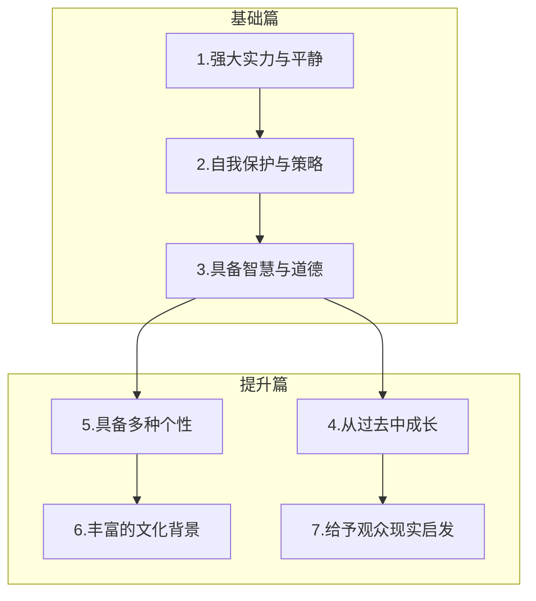

# 休闲番剧角色进化第七境界：触动心灵的启示

## 1. 角色之光，照进现实

大概半年前，我写了《休闲番剧角色进化路线》，总结了我眼中优秀角色的六个阶段：从“强大实力与内心平静的平衡”，到“策略性自我保护”，再到“智慧和道德兼备”、“从悲剧中成长”、“多重个性构建”，以及“文化背景多元融合”。这些都是我在异世界番里琢磨出来的。但当时我啊，有个思维定势——我看东西，都只盯着异世界。

在那些设定超复杂、离现实超远的幻想世界里，角色塑造往往靠强大的设定或者环境推动。我一度也觉得，只有在这些“理想乡”里，才能诞生真正优秀的角色。不过，在那篇文章最后，我埋了个伏笔：“我期待着未来的进化！”

各位观众，让大家久等了！经过了漫长的等待，答案终于要揭晓啦！

现在，就让我们热烈欢迎这位角色的登场！

她就是——波奇酱！

她的出现，就像给我打开了一扇全新的窗户。在她身上，我看到了休闲番剧角色进化的新可能——不是说角色技能有多牛，设定有多复杂，而在于角色能不能给观众带来启发。这，才是新境界！

和之前的六个阶段不一样，波奇不是从异世界来的，也没啥超能力，甚至连正常社交都费劲。但就这么一个“普通”的女孩，却以惊人的真实感打破了次元壁，让我们从“看角色”变成了“被角色看见”。她的成长、她的犹豫、她笨拙又努力的挣扎，不再只是角色经历，而是我们能感受到、能共鸣的现实。

所以我就意识到——这全新的境界，不在于角色有多牛，而在于她是否能在某个瞬间，照亮你的人生。

## 2. 当角色打破次元壁

回想一下，之前的六个境界当然很精彩——从亚梓莎的强大和放松，到梅普露的自我保护哲学，再到米娅公主的成长和反思，每个角色都在自己的世界里闪闪发光。她们的设定和成长轨迹确实很棒，但有个问题：我们始终在欣赏别人的故事。这些角色的经历再好，也和我们的生活有点距离，我们只能远远看看，没法真正和她们产生啥深刻的连接。

然而！波奇酱却打破了这层次元壁，从“虚拟角色”变成了“能和我共鸣的存在”。当她在镜头前手足无措、鼓起勇气努力的时候，我们就不只是观众了，而是参与者。你会忍不住点头：“原来她也和我一样，在努力走出自我啊！”波奇不是那种完美的英雄，她甚至有我们自己的“缺点”和挣扎。但正是这些缺点，让她变成了最贴近现实的角色之一。

制作组通过她的眼神、她的动作、她不经意间的自我剖析，好像把我们内心深处的不安和踌躇都展现出来了。我们经常看到波奇在社交中卡壳，在舞台上紧张到想消失，对自己没自信但仍然在努力。这些情节让你突然意识到：她的故事，不是别人的，是我们的！

就像生活中遇到挫折时，突然看到一段话：“你不孤单，也有人跟你一样迷茫。”波奇就像屏幕那头的一个朋友，或者说是曾经的你自己，正在艰难地变成更好的自己。

她的塑造，让我们重新审视了“自己”的意义。她让我明白，不是每个角色都必须有超能力或者特殊的设定才能打动我们；有时候，“普通”反而最有力量。波奇的成长，是靠一点一滴的努力积累起来的，而这正是我们所有人每天都在做的事。

## 3. 成长，从这里开始

波奇的成长不是一蹴而就的，而是一个充满“小突破”的过程。她的每一次进步，都能让我们清楚地看到她的改变，我们也能跟着一起改变。就像她不善言辞的自我介绍，她迈出的每一步，都让她从被动变得主动和自信。这种成长，不只是她独有的，它也在悄悄影响着我们每个人。

番剧的魅力就在于，当你看到波奇一次又一次迈出那一小步，虽然步子不大，却充满力量时，你会忍不住问自己：“那我呢？我能不能也试着走出自己的舒适圈？”好多观众都在评论区说，看了波奇的成长，自己也开始挑战那些曾经害怕面对的事。她的突破，不只是她个人的胜利，更是给观众的启示：我们也可以！

有时候，番剧不只是展示一个故事，更像是一次内心的“升级”。就像我在一个游戏评论视频里看到的那句话：“优秀的游戏，不在于角色的成长，而在于玩家的成长。”其实，休闲番剧也是这样。波奇的成长过程，不断地给我们提供一面镜子，让我们看到自己可能忽略的潜力。她的每一次突破，都是一种鼓励，告诉我们，即使是最小的一步，也能让我们朝着更好的自己前进。

这才是第七个境界的精髓——不只是为角色设计精彩的成长经历，而是通过角色的成长，把“自我突破”的启示传递给观众。波奇不只是在改变自己，她也在潜移默化地推动我们去改变，让我们一起迎接那些“挑战”，一点点变得更勇敢，走向更广阔的未来。

## 4. 不止角色

回顾之前的六个境界，波奇简直是个跨越了各个阶段的奇迹。她就像一颗在现实世界闪闪发光的星星，完美地符合我们之前定义的休闲番剧角色的三个基础境界。

首先，她有强大的实力和平静的心态。吉他技术一流，但她不骄傲，也没有什么执念，轻松自在，几乎完美地体现了“能力与不拘”的平衡。

其次，她有周密的自我保护和深思熟虑的策略。在她的世界里，社交恐惧让她习惯过度保护自己，但也让她能在关键时刻通过周密的策略力挽狂澜，几次救场的表现简直让人刮目相看。

第三，她有内敛的智慧和坚定的道德。她的智慧体现在不急于表现自己，更在于最终通过乐队的共同努力找到自我认同，这展现了她对团队、对音乐和对自身深刻的理解和责任感。

至于第四个境界——从悲剧中成长，波奇则以一种完全不同的方式打破了框架。她不需要经历像米娅或艾妮丝那样强烈的冲突，她的成长更多地体现在她对自己恐惧的接受、对他人的信任。她的故事充满温暖，但不乏突破。这让我意识到，休闲番剧在呈现反差和温情的主题时，并不需要像以前那样依赖大起大落的戏剧冲突。小小的进步和循序渐进的成长，反而更能契合这种轻松、温暖的氛围。波奇的故事恰恰是这种“慢慢来”的典范，给观众带来的不只是视觉上的享受，更是一种心理上的慰藉和启发。

因此，我决定把第四个境界的定义从“从悲剧中成长”改为“从过去中成长”。这个概念更符合像波奇这样温暖又有力量的角色，也更贴近休闲番剧的需求。

为了更好地展示这个进化路线，从现在开始，我们放弃了线性结构，用树状图来表示这条成长之路。你会看到，休闲番剧角色的成长不再是线性的过程，而更像一棵逐渐展开的技能树——每个分支都代表了一种独特的魅力和可能性。

波奇的故事，不仅仅是关于一个角色的“成长”，更是一个关于“启示”的故事。它让我们看到了角色如何超越自我怀疑，最终获得自信，并激励我们勇敢地迈出人生的下一步。这种进化不仅仅停留在角色层面，更深刻地影响了休闲番剧的创作方向。从此，休闲番剧的角色不再仅仅是为了娱乐或感动观众而存在，她们更是引导我们探索自我、挑战自我的灯塔。就像波奇一样，她们的故事告诉我们，真正的成长不在于经历大起大落，而在于那些平凡的瞬间，找到属于自己的勇气和力量。
