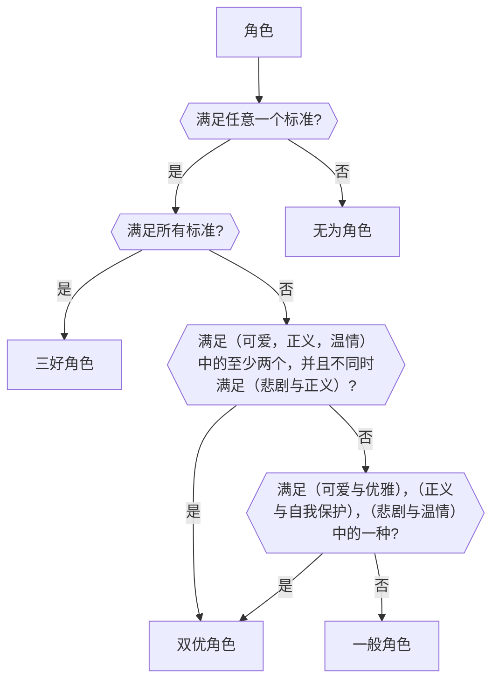

# 芙宁娜观察报告

*Maple-Kaede* *2024-01-02*

## 摘要

> 本文深入研究了《原神》中一位备受瞩目的角色——芙宁娜•德•枫丹，旨在探讨她在外观、性格、剧情表现等方面的独特之处。通过对芙宁娜的分析，揭示了她的可爱与优雅、正义与原则、悲剧与温情等多重特质。然后，通过分析她的特质，提出了超一流角色的六大标准以及对于类似角色的搜索方向。最后，总结了芙宁娜的优秀之处，同时强调了一些剧情中的遗憾，并展望了未来在日本番剧中寻找更为丰富角色的希望。

## I. 引言

### A. 前情提要：过去我对优秀角色的评价标准

在过去的番剧观看经验中，我一直以两大指标为评价优秀角色的主要依据。首先，我关注角色是否怀有强烈的正义感，是否愿意毫不犹豫地伸出援手，成为他人困境中的踏实依靠。其次，我注重观察角色是否能在复杂的伦理和道德抉择中做到善恶分明，既在需要时挺身而出，又在个人权益受到威胁时坚定反抗。

这两大标准在我的番剧观察中发挥了至关重要的作用，帮助我筛选出许多深受喜爱的休闲番剧角色。然而，当芙宁娜闪亮登场时，她为我的评价体系带来了前所未有的颠覆，引入了一种新的六大标准。

芙宁娜以她独特的外貌、多才多艺的性格以及法国文化元素，重新定义了我对于番剧角色的期望。她的到来不仅仅是一场视觉盛宴，更是一次心灵的冲击，使我不得不重新思考、拓展自己对于优秀角色的认知。在接下来的报告中，我将深入剖析芙宁娜的各个层面，探讨她的独特之处，以及在利用这一新标准评选日本番剧中的角色时，可能会面临的挑战。

### B. 芙宁娜简介：她是一位怎样的角色

芙宁娜•德•枫丹，作为《原神》中的水元素角色，凭借她独特而迷人的设计吸引了无数观众的目光。她的外观设计受到法式美学的启发，精妙地融合了日式可爱与法式优雅的元素，展现出了一种非凡的吸引力。这位角色不仅仅是一个外表出众的存在，更是一个展现出多重层次的人物，既有活泼可爱的一面，又展现高贵优雅的一面，给人留下深刻印象。

然而，芙宁娜的魅力不仅仅停留在外貌上。她在故事中经历了深刻的发展，拥有过去的秘密与挣扎。故事中的惊人转折使得观众在情感上得到更为复杂且深沉的体验。她是由芙卡洛斯创造出来的一个人，其存在的目的是维持水神的假象，使芙卡洛斯能够积攒力量，以解决枫丹的诅咒。为了完成这个任务，她必须在500年的时间里保持低调，不被任何人察觉，以免诅咒提前生效。这使得她选择了伪装，与他人保持距离，以防止暴露自己的真实身份。

这是一项孤独而压力巨大的任务，因为芙宁娜需要面对孤独和无法与他人交流的挑战，同时背负着为整个世界的未来而奋斗的巨大责任。她的故事充满着对于身份束缚的挣扎，以及在寂寞的长河中寻找解脱的过程。最终，在故事的高潮中，她成功解除了诅咒，摆脱了长久以来的身份束缚。她在故事结局中得到了解放，为整个枫丹世界带来了新的希望与可能。

## II. 芙宁娜的外观设计

### A. 外观特征：服饰、发型、配饰的妙处

枫丹，这个以法国为原型的国家，为芙宁娜的外观设计提供了深厚的文化底蕴。作为枫丹的公主，她的角色设计处处充满了法国文化的瑰丽和尊贵。芙宁娜身着代表皇家尊贵的蓝色西装，融入了法国国花鸢尾花的图案，以及皇冠、燕尾服等特征，展现出法国宫廷的典雅和奢华。她的服装设计采用了巴洛克风格，巧妙地搭配了克拉巴特领结与拉夫领，突显了她的皇室身份。

在服装上，点缀着大量水滴样式的宝石，不仅象征了尊贵的身份，还与水元素的亲和力相呼应，为她的外观增添了神秘和独特的氛围。这种精致的配饰不仅是装点，更是对于她水元素属性的一种巧妙的象征。

芙宁娜的发型为蓬松的白色短发，略微卷曲，散发出一种优雅的气息。这个发型不仅展现了她的高贵与典雅，同时也巧妙地融入了日式可爱的元素，为角色增色不少。大眼睛的设计也进一步突显了她的可爱之处，是日系可爱的基本特征之一。整体外观设计在融合法国和日本的美学元素上取得了巧妙的平衡，使芙宁娜成为一个兼具多重特质的引人注目的角色。

### B. 可爱、优雅的融合：为何外观设计成为她多才多艺的一部分

芙宁娜的外观设计巧妙地融合了可爱与优雅，使其成为她多才多艺的突出表现。这种独特的融合不仅体现在服饰的选择上，更贯穿于整体外观的方方面面。

首先，她的服饰以法国皇家蓝为基调，这是一种既高贵又充满活力的颜色。这种选择既传达出她作为枫丹公主的尊贵身份，又在颜色的鲜明度中注入了一份俏皮和可爱。蓝色的配搭使她在整体外观中既显得庄重端庄，又不失青春的活力。

其次，特色领结和宝石的运用为她的外貌增色不少。各式各样的领结突显了她女性的柔美气质，同时也勾勒出可爱的轮廓。宝石的点缀则不仅为她的服装注入了奢华感，更在细节处体现了她的优雅品味。这些配饰的巧妙搭配，使她既有公主般的高贵，又透露出甜美的可爱。

最后，蓬松的白色短发成为整体外观中的点睛之笔。这种发型既展现了她的青春活力，又为她的外貌增加了一份清新感和纯洁之美。短发的设计不仅突显了她的个性，还在可爱和优雅之间达到了完美平衡。

这种外观设计的巧妙融合，使芙宁娜成为一个不仅外貌出众，更在性格和气质上多才多艺的角色。她的服饰、发型和配饰不仅仅是外观的点缀，更是她多面性格的视觉表达，为观众呈现出一位充满活力、优雅而可爱的女性形象。

## III. 芙宁娜的性格刻画

### A. 可爱之处：融化人心的笑容和表情

芙宁娜不仅在外表上展现了日系可爱的基本特征，她的性格同样充满了令人喜爱的元素。她以一种活泼而迷人的方式表达自己，性格中带有一点傲娇但不过分。这种微傲娇的特质使得她更加引人注目，给角色增色不少。

其中，她的笑容是她可爱性格的一大特点。芙宁娜喜欢笑，她的笑容灿烂而甜美，给人一种温馨愉悦的感觉。这种积极向上的态度在她的性格中得以充分展现，为观众带来了欢愉的氛围。

此外，她对于甜点的热爱也是她可爱性格的一部分。对美食的热情展现出她对生活的热爱和享受，这一特质不仅为她增添了可爱的一面，同时也使她更加接近观众，引发共鸣。

最后，芙宁娜表情丰富而有趣，展现了她多才多艺的一面。她能在不同场合展现出恰到好处的表情，使得她的性格更加生动有趣。这种可爱的性格特质使得芙宁娜成为一个深受观众喜爱的角色，展现出她独特而迷人的一面。

### B. 优雅之美：言行举止间的高贵品味

作为枫丹的公主，芙宁娜的性格体现出了卓越的优雅品质。她的言谈、行为举止无不散发出高贵典雅的气息，让人感受到她作为王室成员的威严和风度。

首先，芙宁娜在各种场合中展现出熟练的贵族礼仪。她精通各种社交场合的应对之道，无论是宫廷会议还是社交活动，她都能以从容淡定的态度展现她卓越的教养和优雅。这种言谈举止上的高贵素养为她赢得了尊敬和仰慕。

其次，芙宁娜在游戏中的动作设计也是充分体现了她的优雅。参考了拐杖的设计，她的战斗动作十分华丽而富有节奏感，展现了她不仅在日常生活中，甚至在战场上都能保持高贵的仪态。这种高度优雅的动作设计使她在战斗中显得与众不同，为她的角色增色不少。

总体而言，芙宁娜在言谈和行为上的优雅展现，使她成为一个傲娇而又不失亲和力的优雅女性形象。她的高贵和从容不迫的举止为角色增色，同时也使她在整个故事中的地位更为显赫。

## IV. 芙宁娜在剧情中的表现

### A. 悲剧的一面：500年的独角戏

在剧情中，芙宁娜的故事描绘出一幅令人心碎的悲剧画面。她肩负着重大的使命，为了拯救国家，她选择默默地坚守500年之久。在这漫漫岁月里，她的心声被时间封闭，沉浸在寂寞与冷漠的黑暗中。为了扮演水神，她宣告了自己的沉默，承受着无尽的孤独和深刻的挣扎。每一天都是一场长久的夜晚，她成为了自己的陪伴者，沉浸在寂寞的怀抱中。这沉默不仅是对外界的隔绝，更是一种为了守护的责任，是她默默承担的无言的誓言，一种让人心酸的坚守。

随着孤独的岁月不断流逝，芙宁娜的心灵逐渐被麻木所笼罩。哭泣成了一种遥远的体验，她已经渐行渐远离了自己的情感。在某次访客的问询中，当被问及是否在流泪时，芙宁娜的回答却是出乎意料的淡然，“啊哈哈，怎么回事，我都没注意到... 没办法，谁让我是水神呢。” 这段轻松的对话背后却透露着她心灵的麻木。在无尽的孤寂中，她似乎早已忘记了哭泣的滋味，这是一种深沉而令人心酸的沉默，是对时间流逝的无奈沉思。

然而，主角的出现为她的世界带来了一丝曙光。主角声称来自另一个世界，不受这个世界规则的支配，试图诱导芙宁娜分享她的心声，让她知晓这并不会导致计划的失败。在心理斗争中，芙宁娜曾摇摆于选择保密与分享的边缘。她苦恼地思考着，如果是她的话，应该没关系吧。但是万一失败的话，整个国家都会灭亡。她已经坚持这么久了，或许可以稍微为自己考虑一点，但这个自私的想法又让她感到内疚。最终，她选择了沉默，这是一个经过艰难心路历程的抉择，揭示出她内心深处的坚定与无奈。她的沉默不再只是任务的一部分，更是对自己承受的责任的一种默默守护。

在这关键时刻，主角和芙宁娜的对决发生在审判庭。主角运用各种手段逼迫芙宁娜承认她并不是水神。芙宁娜陷入越来越危险的境地，语气也从充满自信转变成哭着哀求。她的声音充满了感染力，让人无法不心碎。在这场决斗中，芙宁娜的内心挣扎达到了巅峰，芙宁娜誓死守住这个秘密，即便面对着威胁和逼迫，她毫不动摇，将这份重托护卫在心底。她的坚持和决心在这个艰难的时刻显得尤为珍贵，为整个情节增添了更多的紧张感和深度。

最终，这个期盼已久的时刻到来了。芙宁娜成功解除了500年的诅咒，而她的眼中闪烁的不仅仅是解脱，更是一抹久违的希望。在解脱的那一刻，她仿佛感受到身体中所有的负担都被抛却，心灵得到解放。她的眉宇间透露出一丝宁静，如同苦难过后终于见到曙光的旅人。这个时刻不仅是她个人的救赎，也是整个故事的高潮，为观众留下深刻的印象。

这一解脱代表了她个人的救赎，是她坚守初心的回报。而更为感人的是，这个解脱不仅给予了她自由，也为整个国家带来了新的可能。芙宁娜的解脱宛如一场春雨，滋润了整个大地，唤醒了沉睡的希望。在她的双眼中，我们看到了那个曾经默默承受的女孩，如今绽放出灿烂的微笑，为她的人生画上了一个新的开始。

### B. 喜剧的一面：重登舞台，重拾自我

在芙宁娜解脱诅咒之后，她陷入了一段时间的沉默与消沉。曾经是枫丹国度最杰出的歌剧演员之一的她，在这段黯淡时光中，决定永远放下舞台，不再扮演任何角色。

然而，主角的坚持和劝说逐渐打破了这层心灵的牢笼。在主角的陪伴下，芙宁娜重新找回了心灵的声音。被劝说参与一次歌剧演出，这成为她人生中一次意想不到的喜剧转折。

在舞台上，芙宁娜并非新手，而是最杰出的歌剧演员之一。她的表演令人惊叹，唤起了过去的辉煌。观众们再次沉醉在她的音律中，发现她并非放弃，而是用更加深刻的表演彰显她的多才多艺。她的歌声，如同一阵清风，扫散了过去的阴霾。这一次，她的表演依然受到了欢迎，最终风靡整个国家，为她赢得了更多的赞誉与认可。

这段喜剧的一面，是芙宁娜重新振翅高飞的故事，是她用音符书写的人生新篇章。不再是沉静的水神，她在喜剧的舞台上展现出的是一个不可忽视的、多才多艺的天使。这次的表演，让她人生中的喜剧超越了过去的悲剧，为她的传奇故事添上了一抹绚烂的色彩。

## V. 参考现实中的原型设计（TODO）

### A. 文本描述中的法国歌剧台词：深入挖掘法国歌剧元素

芙宁娜的文本描述中巧妙地融入了法国歌剧的台词，为她的角色注入了深刻的文学底蕴。这不仅仅是一场游戏，更是对法国文学艺术的致敬。她口中的歌剧台词如同隐喻一般，勾勒出她内心深处的情感和思索。这种文学的融入，使得芙宁娜的角色更加丰满，不仅仅是虚拟世界中的存在，更是文学和艺术的交汇点。

### B. 参考耶稣的设计：灵感来源和形象塑造

芙宁娜在剧情中通过牺牲自己来拯救世人，与耶稣的设计有着惊人的相似之处。这种宏伟的故事线为她的角色注入了宗教和人性的深刻内涵。她不仅仅是一个游戏中的角色，更是一个富有哲理和情感的象征。这个设计不仅唤起了玩家对于历史宗教传说的思考，也赋予了芙宁娜一种超越游戏的存在感。她的牺牲和拯救故事，如同一幅宗教画卷，为整个枫丹的神话传说增添了一抹神秘的色彩。这样的设计，将游戏提升到了艺术的高度，使得芙宁娜的角色成为了深具内涵的人物。

## VI. 游戏中剧情表现的一些不足之处

### A. 角色深度不足：高潮时的情感断裂

在游戏剧情中，芙宁娜的角色受到相对较少的关注，这一瑕疵在整个剧情中显得尤为突出。在主线剧情的高潮部分，主角亲眼目睹了芙宁娜长达500年的内心挣扎。然而，令人感到遗憾的是，随后她的戏份突然结束，未能得到充分的关照。这种处理方式可能导致观众的情绪在达到高潮时无法得到有效的释放，形成了一种[“高高举起，轻轻放下”](../现象观察/高高举起，轻轻放下：番剧紧张情节处理的困境.md)[^1]的不尽人意的情感断裂。在塑造如此复杂性格的角色时，更多的关注和探讨她在整个故事中的地位和发展空间将使得角色更为立体，故事更为圆满。这种局限性不仅影响了对芙宁娜个性深度的理解，使整个剧情略显仓促，同时还让观众错失了深度挖掘这一角色内心世界的机会。

[^1]: “高高举起，轻轻放下” 是一种常见的剧情处理问题，然而在此例中，并未发现导致该问题的常见原因之一。这可能是有意而为，可能是出于市场策略的考量。

### B. 主角的冷淡态度：语气带责备，情感连接不足

在后续的剧情中，主角对芙宁娜的态度似乎缺乏对她过去沉重的500年孤寂的深刻认同，而更倾向于对她的冷漠和疏离。这种冷淡的态度可能影响了观众对她的情感投入，使得角色之间的情感交流显得较为疏离，导致整个故事中的人物关系显得不贴切。

例如，在她的个人剧情中，主角试图寻求她的协助以拯救一个濒临解散的剧团，但她坚决拒绝，表明了她不愿再涉及过去的关系。主角对芙宁娜的回应带有责备，认为她没有为自己留下后路，这样的表达加深了两者之间的疏离感，使整个对话显得冷漠而缺乏共鸣。主角对芙宁娜的情感表达显得缺乏深度，使观众很难认为主角真正理解她所经历的孤独与挣扎。在处理主角与芙宁娜的关系时，更多的情感共鸣和深刻理解将使剧情更为生动、更令人深思。这种缺陷在她的个人剧情中多次显露，引起了社区内广泛而强烈的不满，使得观众在情感投入上遇到障碍，激发了他们的愤怒情绪。

## VII. 在日本番剧中寻找相似的角色

### A. 想法的产生：超越游戏行业的桎梏

尽管这篇文章旨在深入观察芙宁娜这一游戏角色，但其背后的真正动机并非对她未来发展的期待。游戏行业的不透明性和频繁的人事变动可能引发角色设定的扭曲，甚至导致剧情和观众情感上的分歧。在游戏领域，角色通常受到市场策略的制约，有时甚至因制作层面的干预而经历“塌房”般的命运。

因此，文章将聚焦于在日本番剧中寻找类似芙宁娜那样丰富、立体的人物形象。与游戏不同，番剧制作更注重深刻的剧情叙述和人物性格的细腻描绘，无需受制于促销游戏道具的约束。此外，番剧的制作组通常在片尾清晰标明，使观众得以直接根据制作人名单来评估，消除了游戏产业中的一些不透明性。这一切的转变并非对芙宁娜的否定，而是对日本番剧中角色塑造的优秀标准提出更高的要求，旨在在另一个艺术领域中找到更为真实和深刻的角色形象，跨越游戏行业的局限，探寻角色更广阔的可能性。

### B. 搜索目标：如何成为超一流角色

在寻找类似芙宁娜的超一流角色时，我们需要将标准扩展至多个方面，以确保角色在表现和深度上都能够达到高水准。以下是我提出的六个标准，它们被分成三个小组，延续了我以前的文章[《放松与成长》](../总结篇/放松与成长：我对休闲番剧鉴赏标准的演变与启示.md#变化对休闲番剧鉴赏标准的转变总结)中关于正义与原则的主题，同时加入了可爱与优雅、悲剧与温情的要素。通过这些标准，我们可以更加精确地描述一个超一流角色的各项特质要求。

#### 1. 可爱与优雅

* 外在表现：在外貌和举止上，角色需要展现出日式可爱与法式优雅的融合，呈现出一种独特而令人难忘的可爱与优雅。这种融合不仅为动漫中的女性角色呈现了一种清新的风格，而且克服了它们各自的限制。日本的可爱元素通常与高中背景相联系，但有时会显得过于平凡和幼稚。优雅的加入赋予了深度，使创作者能够在学校环境之外探索各种场景。同样，法式优雅通常与多才多艺而温柔的千金形象相联系，但有时也会显得过于超凡脱俗和缺乏亲和力。这时日式可爱就能起到软化角色的作用，增添一些亲和感，使人物更加贴近观众。这样的融合为角色赋予了更为立体和富有层次感的特质，超越了传统刻板印象，创造出更具吸引力和独特性的形象。
* 个人魅力：角色的个人魅力是构建引人入胜形象的关键要素。首先，可爱的台词轻松幽默或甜美动人，不仅为角色注入亲和力，也能在观众中留下深刻印象。有趣的表情则赋予角色生动的面部表情，使她更加具有亲和力和活力。在个性方面，活泼开朗的性格使角色在互动中显得热情洋溢，为番剧注入欢乐氛围。聪明才智和解决问题的能力展示了她的智慧一面，使她在剧情中更具有内涵。这些特质的结合不仅使角色更加立体，也使观众更容易产生情感共鸣，与她的成长和经历建立更为紧密的联系。这样的个性魅力将为番剧带来更加生动和深刻的角色体验。

#### 2. 正义与原则

* 行为操守：在正义与原则这一要素中，行为操守是建构积极榜样的核心。角色的行为应当贴合特定的道德准则，以在观众心中塑造出积极向上的榜样。尤其对于那些拥有强大力量的主角而言，遵循“不作恶”的原则显得尤为关键。
角色的行为表现不仅应该体现出善良、正直的一面，更需要在面对困境和选择时，能够坚守内心的道德信仰。这不仅是对角色本身的塑造有着深远的影响，同时也为观众提供了积极向善的榜样，激发了道德思考和情感投入。通过在关键时刻选择正义的道路，角色将在观众中留下深刻的印象，使番剧更具教育意义和引导性。
* 自我保护：自我保护原则在角色建构中扮演着至关重要的角色。通过表现出积极保护自己的态度，角色能够有效遏制自身受到侵害，从而避免给观众带来消极和绝望的情感。
这一原则不仅体现在角色在面对敌对势力时的果断反击，更表现在她对自己情感和内心世界的保护。角色应该学会在必要时坚定地捍卫自己的权益和尊严，不被外界的压力和困难摧毁。这种自我保护的态度既增强了角色的魅力，也为观众提供了一种积极向上的情感共鸣。当角色能够坚定地守护自己的界限时，她将在观众的心中留下坚强、自信的形象，引发共鸣并激发情感投入。

#### 3. 悲剧与温情

* 悲剧元素：角色的悲剧元素应当是复杂而深刻的，通过揭示角色在生活中的困境、挣扎和痛苦，引发观众的共鸣和同情。这些悲剧元素可以是与过去相关的悲伤经历、人际关系的破裂，或者是内在的心灵挣扎。这样的悲剧内核不仅能够深刻地刻画角色的情感世界，同时也为角色的成长和变化提供了动力。
在表现悲剧元素时，创作者可以通过细腻的描写，展现角色内心的矛盾与纠结，使观众更好地理解和感受角色所经历的痛苦。悲剧并非仅仅是为了制造情感波动，更应该是对角色深层次的人性揭示，以引起观众对角色命运的思考。
* 成长历程：经历悲剧之后，角色的成长历程应当呈现出深刻的治愈和内心的强大。泪水成为情感的载体，使得角色的成长历程更为意义深远。这个过程不仅是对悲剧的应对，更是对自身的认知和接纳，使角色逐渐超越过去的痛苦。
治愈的过程中，角色可能通过与他人建立更加真挚的关系，寻找新的生活方向，或者通过一些具有象征意义的场景实现内心的转变。观众通过角色的成长历程，能够感受到希望和温情的涌现，使整个故事既有悲剧的深沉，又有治愈的温暖。
平衡悲剧和温情的关系至关重要，避免故事过于沉重或夸张。角色的成长应当既真实而深刻，又富有希望和温暖，为观众带来更为感人和打动人心的故事体验。

通过这六大标准，我们能够超越单一维度的角色塑造，综合考量各个方面的特质。这使得我们有望找到那些像芙宁娜一样，在人物表现和情感深度上都能令人满意的超一流角色。这个标准不仅为观众提供了在日本番剧中寻找出色角色的方向，也为创作者们提供了一个全面思考角色塑造的框架，以打造更加引人入胜、感人至深的故事。

### C. 角色选择挑战：为何难以在日本番剧中找到相似角色？

在日本番剧中寻找类似芙宁娜的超一流角色时，我们也要正视一些寻找这类角色所面临的挑战。这些挑战可能影响角色的深度和故事的展开。

1. **日系校园格局的依赖**[^2]：在日本番剧中，学校设定是一个常见而固定的框架。这使得角色往往受制于学生、老师、课程等元素，难以摆脱学校环境的限制。对于超一流角色而言，他们的背景往往需要更为多元，可能涉及不同行业、社会背景或甚至异世界的设定。然而，在学校环境中，这样的多样性可能受到一定制约，使得超一流角色的全貌难以展现得淋漓尽致。在选择角色设定时，创作者需要思考如何巧妙避免对校园题材的依赖，以更创新的方式呈现角色的内在品质和故事发展。
2. **难以呈现深刻的内在挣扎**[^3]：日本番剧在处理严肃话题时，尤其是政治和战争等复杂议题方面，通常表现出一定的逻辑性不足。这可能使创作者在塑造角色的内在挣扎时面临挑战，尤其是当角色需要深入探讨重大议题、承受心灵创伤或者面对道德困境时。类似芙宁娜一样的超一流角色通常需要通过深刻而合理的内在挣扎，使观众更好地理解和共鸣。然而，由于日本番剧在处理某些复杂主题时可能显得表面，这可能导致超一流角色的内在挣扎难以得到充分而有力的呈现。在这种情况下，创作者需要寻找巧妙的表达方式，以确保角色深刻的内在体验能够贴近观众的心灵。
3. **爱情设定的束缚**[^2]：优雅的性格和公主角色往往被用于爱情题材，而这可能会成为塑造角色更多面貌的一种束缚。爱情情节往往倾向于强调浪漫和感性的一面，在某种程度上限制了超一流角色在其他领域的发展。为了符合爱情题材的情感张力，创作者可能更倾向于突出角色的浪漫一面，而较少涉及其他更复杂的特质。这使得角色的形象在故事情节中显得相对单一，难以展示出其更为多元和引人入胜的一面。对于寻找类似芙宁娜的角色来说，应该超越传统的爱情框架，寻找更广阔的表现空间，以更好地展现角色的丰富性和深度。

[^2]: 该问题来源于《堤亚穆帝国物语》
[^3]: 该问题来源于《转生王女与天才千金的魔法革命》 

综上所述，在日本番剧寻找类似芙宁娜的角色中确实面临着诸多挑战。番剧往往受限于特定设定和情节，可能难以呈现出超一流角色所需的多样性和深度。对校园格局的依赖、难以呈现深刻的内在挣扎，以及爱情设定的束缚等因素，都为塑造这类角色带来了困难。事实上，迄今为止，我尚未发现任何一个完全符合这一标准的角色。然而，正是通过这些挑战，我们更能认识到芙宁娜独特的闪光点。在未来，随着创作者对角色塑造的不断探索，或许我们能够在日本番剧中找到更为丰富而引人深思的角色形象。

## VIII. 目前的搜索方向

尽管在日本番剧中搜索类似芙宁娜的角色非常困难，但目前我还是确定了两个搜索方向，以期待最大化地增加命中的可能性。在这些方向的探索中，或许能够找到那位令人神往的超一流角色，为观众呈现出一场视听盛宴。

### A. 异世界公主番剧：注入优雅和神秘感，提供广阔的剧情发展空间

在追寻类似芙宁娜的角色时，我决定将目光聚焦于异世界番剧，特别是那些涉及公主角色的剧情。这选择并非偶然，因为只有在异世界的奇幻背景下，公主的身份才能为角色注入独特的优雅和神秘的氛围。这一方向的优势在于，公主身份所带来的高贵与日本番剧所独有的可爱元素相得益彰，有望为观众带来类似芙宁娜的情感体验。异世界的奇幻魔法设定也为剧情的发展提供了更广阔的空间。这意味着角色可能面临更多元的内外部冲突，从而增加了角色成长和观众情感投入的深度。

这样的异世界设定为剧情发展提供了更多元的题材，同时也让观众能够沉浸在独特的奇幻魔法世界中。通过追寻这个方向，我希望观众能在番剧中找到那朵让人无法不动容的瑰丽之花，创造一场感官和情感上的难忘之旅。

### B. 休闲番剧：创造温馨自由的剧场，展现角色美丽自在的一面

另一条我正在追寻的线索是在休闲番剧中寻找那个独特的角色。我期待着这个特殊的角色设计能够在轻松、愉悦的情境中脱颖而出，为她提供一个更为安全温馨的环境，以最大限度地挖掘她的潜力。这样的番剧舞台将为她创造一个广阔而自由的剧场，让她可以自由自在地展现自己的美丽，就如同芙宁娜在游戏中那样，轻盈自由地舞蹈于枫丹大剧场。

在休闲番剧的氛围中，观众有机会在欢笑和放松的背后感受到这个角色所带来的独特魅力。这个方向的优势在于，这样的番剧通常强调角色之间的日常互动和成长，为观众提供了更多机会去深入了解角色的内心世界，从而建立更加深厚的情感联系。通过在休闲番剧中的寻找，我渴望找到那个能够引起共鸣、给予观众感动的芙宁娜式角色。

### C. 现状：搜索仍然困难，但有两个潜在角色值得注意

尽管我目前在探寻类似芙宁娜的角色中尚未发现完美符合所有要求的人选，但在这个探索的过程中，我发现了两位杰出的角色，她们的名字闪耀着独特的光芒。她们分别是《转生王女与天才千金的魔法革命》中的艾妮斯菲亚•温•帕雷提亚公主和《堤亚穆帝国物语》中的米娅•露娜•堤亚穆公主。这两位公主不仅令人印象深刻，而且在很大程度上符合超一流角色的标准，拥有可爱、优雅、悲剧和温情等多方面的特质。

艾妮斯菲亚的悲剧源于她不能使用魔法而受到贵族嘲笑和忽视。然而，她毫不气馁，通过创立魔学，使得普通人也能享受魔法的便利。这一举措不仅改变了她个人的命运，还彻底颠覆了整个王国的魔法体系，展现出令人动容的温情元素。艾妮斯菲亚的坚持和努力最终为王国带来了翻天覆地的变革。

米娅则在上一个世界线经历了革命与处刑的悲剧。然而，在当前时刻，她展现了惊人的坚韧与成长。通过在贫民窟设立医院、阻止和少数民族的纷争等重要决定，米娅展现了她强大的领导力和为人民谋福祉的决心。这一系列举措与她过往的苦难形成鲜明的对比，彰显了她的进步和成熟。

这两位公主与芙宁娜一样，都与法国文化紧密相连。米娅的原型是法国历史上的玛丽王后，而艾妮斯菲亚赠予千金尤菲莉亚的定情信物法杖叫做"arc en ciel"，在法语中意为"彩虹"。这样的设计更深化了她们与法国文化的关联。

虽然她们可能未能完全取代芙宁娜的独特魅力，但她们的光辉足以让观众在她们的故事中寻找到那份相似的美丽与感动。在未来的探索中，我将继续寻找更多类似的角色，以期找到那位能够在各个方面都达到超一流标准的角色，给观众带来更为难忘的体验。愿每一位角色都能如艾妮斯菲亚和米娅一样，散发着令人陶醉的光芒。

## IX. 总结与展望

### A. 芙宁娜：一位折翼的天使

芙宁娜，如同一位折翼的天使，她在外观、性格和剧情表现中散发着无法忽视的独特光彩。她的外貌设计巧妙地将可爱与优雅融为一体，勾勒出一副令人心驰神往的画卷。在性格上，她的坚持与沉默，以及内心深处的挣扎，为她赋予了丰富的层次和情感深度。在剧情中，芙宁娜的悲剧元素与温情描绘得淋漓尽致，她的沉默抉择与解脱救赎展现了角色的成长和坚韧。

但是，这位天使的羽翼并非完整，她的形象在某种程度上被剧情的遗憾所折磨。对于芙宁娜的角色地位，尤其是在剧情尾声部分，关注度相对较低，这导致了观众情感投入的一些障碍。主角对她的态度犹如寒风吹过，缺乏对她内心深处挣扎的温暖理解，这使得角色之间的情感交流显得疏离。这样的遗憾让她的形象，如同那折断的羽翼，显得更为令人心痛。

她的形象一直留存在我的心中，不仅因为她的内心挣扎，更是因为那份被浪费的潜力所带来的深深遗憾。展望未来，期待看到更多卓越的角色在日本番剧中崭露头角，她们或许能够弥补这些遗憾，给观众带来更加深刻的印象。

### B. 不断超越极限：从一维，到双优，再到三好

在关注日本番剧的早期，我注意到角色的设计通常是先给角色贴上一个标签，例如正义、温柔、傲娇、天真等，再围绕这一标签设计角色的外貌和性格等，形成最基本的一维角色。然而，随着我对休闲番剧的深入了解，我开始发现双优角色的存在，这些角色具备两种截然不同的特质，如正义与原则、强大与温柔、悲剧与温情，使得角色更加复杂，更能深入观众心灵。

而当我遇到芙宁娜时，我发现了全新的三好角色标准。她不仅具备多维度的特质，而且这些特质相互交织，呈现出更为复杂和深刻的角色形象。这让我深切体会到，角色的设计可以超越传统的一维标签，走向更为综合和多元的方向。

通过这一路程，我将不断探索日本番剧角色的塑造，致力于不断超越极限。正如俗话所说，“天空即为极限”，我相信未来会有更多富有创意和深度的角色涌现，为观众呈现更为引人入胜的番剧世界。虽然绝对完美的角色可能不存在，但是在这由一维到双优再到三好的突破中，角色不断发生质变，朝着更有光亮的方向前进。这种不懈的追求和突破，为番剧的角色塑造开辟了更为广阔的天地。

### C. 展望未来：在迷雾中前行

在面对在日本番剧中寻找类似角色的艰辛时，我们深感这一任务的复杂性。然而，随着芙宁娜的闪亮登场，她所展现的独特魅力或许能够成为日本番剧创作者的灵感之源。期望这一独特形象能够激发更多有趣而富有创意的角色设计和故事构思，为未来的番剧创作带来新的可能性。愿这股风潮不仅仅是芙宁娜个人的成功，更是引领整个日本番剧走向多元、独特和富有深度的新篇章。怀揣着这份梦想，我们对未来充满期待，相信将有更多独具魅力的角色在银幕上绽放，带领观众走向窗外的世界，共同飞翔在梦想的蔚蓝天空。

## X. 附录

### A. 目前我对优秀角色的判断标准

为了更全面地评估角色的优劣，我设计了一个决策树，这个决策树考量了可爱、优雅、正义、自我保护、悲剧和温情六个标准，使我能够更科学地评价和分类不同类型的角色。希望这一决策树能够为我今后的番剧观赏提供更有深度和全面性的判断依据。

### B. 联系我

如果您了解或发现了类似芙宁娜的优秀角色，我们欢迎您分享这一宝贵信息。请将相关信息发送至[exchar@maple-kaede.eu.org](mailto:exchar@maple-kaede.eu.org)。通过您的分享，我们有望发现更多丰富、引人入胜的角色形象，共同推动日本番剧的创新和进步。感谢您的参与和支持。